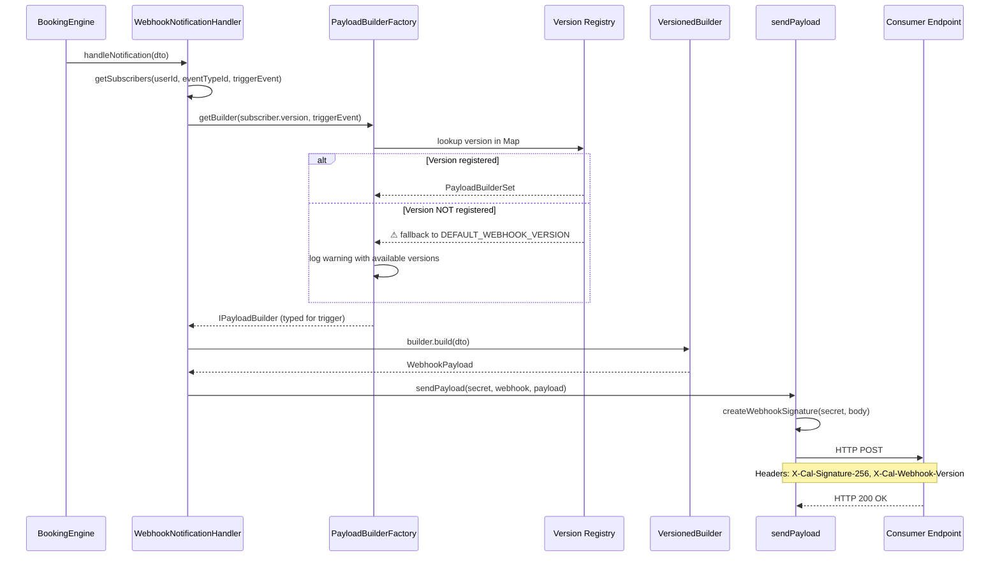
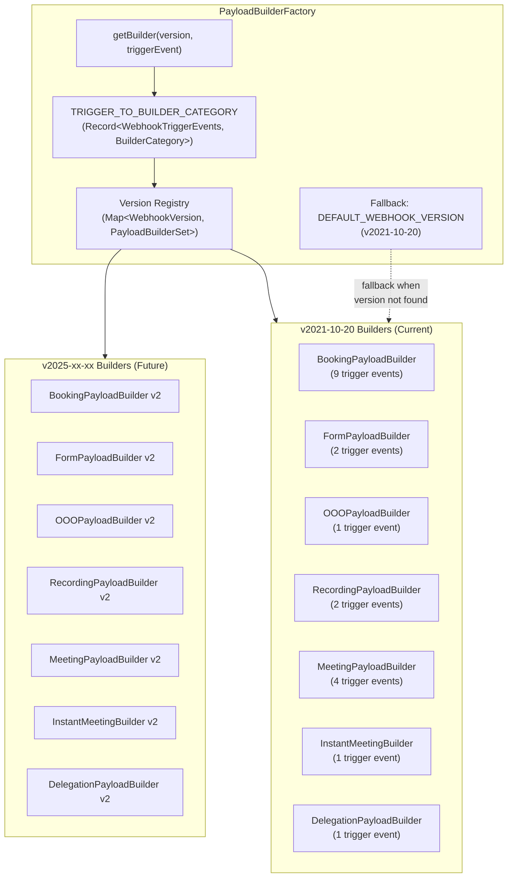

## Overview

As the Calendly gap closure initiative introduces new webhook features and extends existing payload structures, **existing webhook consumer integrations must continue functioning without disruption**. Cal.com's webhook system already serves production integrations — CRM synchronizations, payment processors, analytics pipelines, and custom automation workflows — that depend on stable payload contracts.

This guide defines the **backward compatibility guarantees**, **versioned payload extension patterns**, and **consumer migration path** that every webhook change during the gap closure effort must follow.

<Note>
  **Guiding Principle: Additive-Only Payload Changes.** New fields may be added to webhook payloads, but existing fields **MUST NOT** be removed, renamed, or have their types changed. This ensures every existing consumer integration continues to function without code changes.
</Note>

The core mechanism enabling this guarantee is the `PayloadBuilderFactory` — a version-aware factory pattern that routes webhook payloads through version-specific builders, allowing new payload formats to coexist alongside existing ones.

`Source: packages/features/webhooks/lib/factory/versioned/PayloadBuilderFactory.ts`

**Related Guides:**

- [Zero-Downtime Migration Strategy](/migration/zero-downtime-strategy) — schema migration patterns for the gap closure initiative
- [Data Preservation](/migration/data-preservation) — guarantees for existing user data through all migrations
- [Webhooks & Event Lifecycle Gap Analysis](/gap-report/webhooks-events) — full Calendly-vs-Cal.com webhook comparison

---

## Current Webhook Versioning Architecture

Cal.com implements a **version-aware webhook delivery system** that ensures payload format stability across webhook evolution. The architecture consists of four key components: a version enum, a payload builder factory, version-specific builder sets, and HTTP headers that communicate the payload version to consumers.

### WebhookVersion Enum

The `WebhookVersion` constant object defines all supported payload format versions. It is a **TypeScript-only enum** (not a Prisma enum), with database operations enforced through the repository layer.

`Source: packages/features/webhooks/lib/interface/IWebhookRepository.ts`

| Constant | Value | Status |
|----------|-------|--------|
| `V_2021_10_20` | `"2021-10-20"` | Current default — the only registered version |

**Key definitions:**

- **`DEFAULT_WEBHOOK_VERSION`** — Set to `V_2021_10_20`. Used for new webhook subscriptions and as the fallback when a requested version is not registered.
- **`VALID_WEBHOOK_VERSIONS`** — A `Set<string>` auto-populated from `Object.values(WebhookVersion)`. Used for input validation.
- **`isValidWebhookVersion(value)`** — Type guard function that checks membership in `VALID_WEBHOOK_VERSIONS`.
- **`parseWebhookVersion(value)`** — Validation function that returns a typed `WebhookVersion` or throws an `Error` with a descriptive message listing valid versions.

### HTTP Headers

Every webhook delivery includes two critical HTTP headers that enable consumer verification and version awareness:

| Header | Purpose | Source |
|--------|---------|--------|
| `X-Cal-Webhook-Version` | Identifies the payload format version (e.g., `2021-10-20`) | `sendPayload.ts` line 341 |
| `X-Cal-Signature-256` | HMAC-SHA256 signature for payload authenticity verification | `sendPayload.ts` line 340 |

The `X-Cal-Signature-256` header is computed using the `createWebhookSignature` function:

```ts
createHmac("sha256", secret).update(body).digest("hex")
```

If no secret is configured on the webhook subscription, the header value defaults to `"no-secret-provided"`.

`Source: packages/features/webhooks/lib/sendPayload.ts`

### Webhook Delivery Sequence

The following diagram illustrates how the webhook version flows through the delivery pipeline, from the booking engine through the factory to the consumer endpoint.



---

## `v2021-10-20` Payload Preservation Guarantees

All existing `v2021-10-20` webhook payloads **MUST remain unchanged** throughout the gap closure initiative. Any consumer currently receiving `v2021-10-20` payloads will continue to receive identical payload structures indefinitely.

### Preserved Payload Type

The `V20211020BookingEventPayload` type explicitly preserves the legacy `assignmentReason` format, distinct from the internal `CalendarEvent` representation:

`Source: packages/features/webhooks/lib/factory/versioned/v2021-10-20/types.ts`

```ts
type V20211020BookingEventPayload = Omit<EventPayloadType, "assignmentReason"> & {
  assignmentReason?: { reasonEnum: string; reasonString: string }[] | null;
};
```

The internal `CalendarEvent` uses a transformed `{ category, details }` shape for `assignmentReason`, but the `v2021-10-20` webhook contract exposes the legacy raw array format `[{ reasonEnum, reasonString }]` from the database. This type override ensures the webhook contract remains stable for existing subscribers.

### Builder Implementations

The `v2021-10-20` version provides **7 specialized builder implementations**, each handling a specific category of trigger events:

| Builder | Trigger Events Handled | Count |
|---------|----------------------|-------|
| `BookingPayloadBuilder` | `BOOKING_CREATED`, `BOOKING_RESCHEDULED`, `BOOKING_CANCELLED`, `BOOKING_REJECTED`, `BOOKING_REQUESTED`, `BOOKING_PAYMENT_INITIATED`, `BOOKING_PAID`, `BOOKING_NO_SHOW_UPDATED`, `WRONG_ASSIGNMENT_REPORT` | 9 |
| `FormPayloadBuilder` | `FORM_SUBMITTED`, `FORM_SUBMITTED_NO_EVENT` | 2 |
| `OOOPayloadBuilder` | `OOO_CREATED` | 1 |
| `RecordingPayloadBuilder` | `RECORDING_READY`, `RECORDING_TRANSCRIPTION_GENERATED` | 2 |
| `MeetingPayloadBuilder` | `MEETING_STARTED`, `MEETING_ENDED`, `AFTER_HOSTS_CAL_VIDEO_NO_SHOW`, `AFTER_GUESTS_CAL_VIDEO_NO_SHOW` | 4 |
| `InstantMeetingBuilder` | `INSTANT_MEETING` | 1 |
| `DelegationPayloadBuilder` | `DELEGATION_CREDENTIAL_ERROR` | 1 |

`Source: packages/features/webhooks/lib/factory/versioned/v2021-10-20/`

### Exhaustive Trigger Mapping

The `TRIGGER_TO_BUILDER_CATEGORY` constant is typed as `Record<WebhookTriggerEvents, BuilderCategory>`, which provides **compile-time validation** that every trigger event in the Prisma enum maps to exactly one builder category. If a new trigger event is added to the Prisma enum without updating this mapping, TypeScript will produce a compilation error — preventing gaps in webhook coverage.

`Source: packages/features/webhooks/lib/factory/versioned/PayloadBuilderFactory.ts (line 80)`

---

## `PayloadBuilderFactory` Extension Patterns

Adding a new webhook version is designed to be **safe and isolated** — no existing version code is modified, and the factory's fallback mechanism ensures existing consumers are never disrupted.

### Step-by-Step: Adding a New Version

<Steps>
  <Step title="Create a new versioned directory">
    Create `packages/features/webhooks/lib/factory/versioned/v2025-01-01/` (using the target release date as the version identifier).
  </Step>
  <Step title="Implement all 7 builder interfaces">
    Each builder must implement the corresponding typed interface from `PayloadBuilderFactory.ts`:

    - `IBookingPayloadBuilder` — handles all booking trigger events
    - `IFormPayloadBuilder` — handles form submission events
    - `IOOOPayloadBuilder` — handles out-of-office events
    - `IRecordingPayloadBuilder` — handles recording and transcription events
    - `IMeetingPayloadBuilder` — handles meeting lifecycle events
    - `IInstantMeetingBuilder` — handles instant meeting events
    - `IDelegationPayloadBuilder` — handles delegation error events

    All 7 builders are **required** — the `PayloadBuilderSet` interface enforces this at compile time.
  </Step>
  <Step title="Export all builders from an index.ts">
    Create `versioned/v2025-01-01/index.ts` that re-exports all builder classes for clean import in the registry.
  </Step>
  <Step title="Register in the version registry">
    Update `registry.ts` to import and register the new version:

    ```ts
    import * as V2025_01_01 from "./v2025-01-01";

    factory.registerVersion("2025-01-01", {
      booking: new V2025_01_01.BookingPayloadBuilder(),
      form: new V2025_01_01.FormPayloadBuilder(),
      ooo: new V2025_01_01.OOOPayloadBuilder(),
      recording: new V2025_01_01.RecordingPayloadBuilder(),
      meeting: new V2025_01_01.MeetingPayloadBuilder(),
      instantMeeting: new V2025_01_01.InstantMeetingBuilder(),
      delegation: new V2025_01_01.DelegationPayloadBuilder(),
    });
    ```
  </Step>
</Steps>

`Source: packages/features/webhooks/lib/factory/versioned/registry.ts`

### PayloadBuilderSet Interface

Every registered version must provide a **complete** `PayloadBuilderSet` — there are no optional builders:

```ts
interface PayloadBuilderSet {
  booking: IBookingPayloadBuilder;
  form: IFormPayloadBuilder;
  ooo: IOOOPayloadBuilder;
  recording: IRecordingPayloadBuilder;
  meeting: IMeetingPayloadBuilder;
  instantMeeting: IInstantMeetingBuilder;
  delegation: IDelegationPayloadBuilder;
}
```

`Source: packages/features/webhooks/lib/factory/versioned/PayloadBuilderFactory.ts (line 62)`

### Fallback Behavior

If a consumer's webhook subscription requests a version that is not registered in the factory, the system responds gracefully:

1. The `getBuilderSet(version)` method checks the internal `Map<WebhookVersion, PayloadBuilderSet>` for the requested version.
2. If not found, it **logs a warning** with the requested version, the default version, and all available versions.
3. It returns the **default builder set** (`v2021-10-20`), ensuring the consumer still receives a valid payload.

This fallback behavior guarantees that a misconfigured or outdated webhook subscription never causes delivery failures.

`Source: packages/features/webhooks/lib/factory/versioned/PayloadBuilderFactory.ts (lines 193–205)`

### Composition Root

The `createPayloadBuilderFactory()` function in `registry.ts` serves as the **composition root** for the webhook payload system. It instantiates the factory with the default version and builder set, then registers any additional versions. Consumers obtain a fully configured factory instance by calling this single function.

`Source: packages/features/webhooks/lib/factory/versioned/registry.ts (lines 35–49)`

---

## `WebhookVersion` Enum Extension Patterns

When introducing a new webhook payload version, the `WebhookVersion` enum must be extended to include the new version identifier. This section documents the safe extension pattern.

### Adding a New Version

Extend the `WebhookVersion` const object in `IWebhookRepository.ts`:

```ts
const WebhookVersion = {
  V_2021_10_20: "2021-10-20",
  V_2025_01_01: "2025-01-01", // New version for gap closure
} as const;
```

`Source: packages/features/webhooks/lib/interface/IWebhookRepository.ts`

### Automatic Validation

The `VALID_WEBHOOK_VERSIONS` set is constructed from `Object.values(WebhookVersion)`, so adding a new entry to the `WebhookVersion` const automatically makes it a valid version for input validation — no separate registration step is needed.

```ts
const VALID_WEBHOOK_VERSIONS: Set<string> = new Set<string>(Object.values(WebhookVersion));
```

### Preserving the Default

<Warning>
  **`DEFAULT_WEBHOOK_VERSION` must remain `V_2021_10_20`** to preserve backward compatibility. Existing webhook subscriptions that do not specify a version will continue using the original default. Only change the default version if and when **all** existing consumers have migrated.
</Warning>

### Validation Functions

The helper functions automatically support the new version without modification:

- **`isValidWebhookVersion(value)`** — Returns `true` for any value in `VALID_WEBHOOK_VERSIONS` (which now includes the new version).
- **`parseWebhookVersion(value)`** — Returns the typed `WebhookVersion` for valid inputs. Throws a descriptive error listing all valid versions for invalid inputs.

---

## Additive Payload Field Rules

The following rules govern how webhook payloads may be extended during the gap closure initiative. These rules apply to both modifications within an existing version and the creation of new versions.

### Compatibility Rules

| Rule | Requirement | Rationale |
|------|-------------|-----------|
| **R-1** | New fields **MUST** be optional | Existing consumers that do not expect new fields will ignore them during JSON deserialization |
| **R-2** | Existing field types **MUST NOT** change | Changing a `string` to a `number` (or any other type change) breaks consumer type expectations |
| **R-3** | Existing field names **MUST NOT** be renamed | Consumers rely on exact field names for deserialization and data extraction |
| **R-4** | Existing fields **MUST NOT** be removed | Any documented field may be depended upon by any consumer integration |
| **R-5** | New trigger events **MAY** be added | Consumers subscribe to specific triggers, so new triggers do not affect existing subscriptions |
| **R-6** | The `WebhookPayload` union type **MAY** have new members | The `payload` discriminated union in `WebhookPayload` can be extended with new payload types for new event categories |

`Source: packages/features/webhooks/lib/factory/types.ts (WebhookPayload interface)`

### Gap Severity Classification for Violations

| Violation | Gap Severity | Impact |
|-----------|-------------|--------|
| Removing an existing field from `v2021-10-20` | **Critical** | Breaks all consumers expecting that field |
| Changing a field type in `v2021-10-20` | **Critical** | Breaks consumer deserialization |
| Renaming a field in `v2021-10-20` | **Critical** | Breaks consumer field access |
| Adding a required field to `v2021-10-20` | **High** | May cause validation failures in strict-schema consumers |
| Adding an optional field to `v2021-10-20` | **Low** | Safe — consumers ignore unknown fields |
| Adding a new trigger event | **Low** | Safe — consumers subscribe to specific triggers |
| Creating a new payload version | **Low** | Safe — existing consumers are unaffected |

<Warning>
  **Breaking changes to webhook payloads require a new version.** Never modify the existing `v2021-10-20` payload structure. If a payload change is not backward-compatible, create a new version (e.g., `v2025-01-01`) with the updated structure.
</Warning>

---

## Consumer Migration Path

When a new webhook payload version is introduced, existing consumers can migrate at their own pace. The following workflow describes the recommended migration process.

<Steps>
  <Step title="Discover — Check the current version header">
    Consumers inspect the `X-Cal-Webhook-Version` header in incoming webhook deliveries to identify the current payload version they are receiving (e.g., `2021-10-20`).
  </Step>
  <Step title="Evaluate — Review new version documentation">
    Consumers review the new version's payload documentation to understand what fields have been added, what new trigger events are available, and whether any behavioral changes apply to their use case.
  </Step>
  <Step title="Update — Handle new fields in consumer code">
    Consumers update their webhook processing code to handle any new fields they want to use. Because new fields are always optional, consumers can adopt them incrementally.
  </Step>
  <Step title="Switch — Update the webhook subscription version">
    Consumers update their webhook subscription via the Cal.com API to request the new version. This can be done with a `PATCH /v2/webhooks/{webhookId}` request setting the `version` field to the new version string.
  </Step>
  <Step title="Verify — Validate payload signatures">
    After switching, consumers verify that incoming payloads pass HMAC-SHA256 signature verification using their stored webhook secret:

    ```ts
    import { createHmac } from "crypto";

    const expectedSignature = createHmac("sha256", webhookSecret)
      .update(requestBody)
      .digest("hex");

    const isValid = expectedSignature === request.headers["x-cal-signature-256"];
    ```
  </Step>
</Steps>

<Note>
  **No forced migration.** Consumers who do not update their webhook subscription version will continue receiving `v2021-10-20` payloads indefinitely. The `DEFAULT_WEBHOOK_VERSION` remains `v2021-10-20`, and the factory fallback ensures uninterrupted delivery.
</Note>

### Version Comparison

| Aspect | `v2021-10-20` (Current) | Future Version (e.g., `v2025-01-01`) |
|--------|------------------------|--------------------------------------|
| **Status** | Default, stable, production | Opt-in after release |
| **assignmentReason format** | Legacy array: `[{ reasonEnum, reasonString }]` | Transformed: `{ category, details }` (or new shape) |
| **New trigger event payloads** | Original payload shapes | May include enriched fields or new event-specific data |
| **Backward compatible** | N/A (baseline) | New version preserves all existing fields, may add optional fields |
| **Consumer action required** | None | Update subscription version via API when ready |
| **Fallback behavior** | Always available as default | Falls back to `v2021-10-20` if version is deregistered |

---

## Calendly Webhook Comparison Context

Understanding Calendly's webhook model provides context for why Cal.com's versioning architecture is valuable and where it already exceeds Calendly's capabilities.

| Capability | Calendly | Cal.com | Comparison |
|-----------|----------|---------|------------|
| **Webhook events** | 3 events (`invitee.created`, `invitee.canceled`, `routing_form_submission.created`) | 20 events across 7 builder categories | Cal.com provides 17 additional event types |
| **Payload versioning** | No versioning — single fixed payload format | Versioned via `PayloadBuilderFactory` with `X-Cal-Webhook-Version` header | Cal.com enables backward-compatible payload evolution |
| **Signature verification** | No native cryptographic signing | HMAC-SHA256 via `X-Cal-Signature-256` header | Cal.com provides stronger consumer security |
| **Inline event data** | Event URI only (requires follow-up API call for details) | Complete event data inline in every payload | Cal.com eliminates round-trip API calls |
| **Custom payload templates** | Not supported | Handlebars-based per-webhook templates | Cal.com allows payload customization without middleware |
| **Subscription scoping** | Organization or user scope only | User, event type, team, organization, and platform scope | Cal.com enables more granular webhook targeting |
| **Retry policy** | Not documented in public API docs | 5 retries with exponential backoff (1m → 5m → 30m → 2h → 24h) | Cal.com provides explicit delivery guarantees |

**Behavioral Source of Truth:** Calendly's webhook documentation at [developer.calendly.com](https://developer.calendly.com) is used as the authoritative benchmark for the comparisons above.

<Note>
  Cal.com's `PayloadBuilderFactory` versioning pattern has **no Calendly equivalent**. Calendly does not support payload versioning, making Cal.com's architecture more resilient to API evolution. This is a significant Cal.com advantage that the gap closure initiative preserves and extends.
</Note>

---

## Webhook Version Architecture

The following diagram illustrates the complete `PayloadBuilderFactory` architecture, showing how the version registry routes to version-specific builder sets and how the fallback mechanism ensures continuous delivery.



`Source: packages/features/webhooks/lib/factory/versioned/PayloadBuilderFactory.ts`

---

## Rollback Procedures

If a new webhook version introduces unexpected issues — payload format errors, consumer processing failures, or performance degradation — the following rollback procedures restore service without data loss.

### Consumer-Level Rollback

Consumers can independently revert to the previous version by updating their webhook subscription:

```ts
// PATCH /v2/webhooks/{webhookId}
{
  "version": "2021-10-20"
}
```

This immediately switches the consumer back to `v2021-10-20` payloads. No data is lost — the consumer simply receives payloads in the original format going forward.

### Factory-Level Fallback

The `PayloadBuilderFactory` always maintains the default builder set (`v2021-10-20`) as a permanent fallback. If a new version is deregistered from `registry.ts`, any webhook subscriptions still referencing that version will automatically fall back to the default version with a warning log.

**Fallback behavior chain:**

1. Consumer sends webhook subscription with version `v2025-01-01`
2. Factory checks registry: version found → use version's builders
3. If version NOT found (deregistered or invalid) → log warning → use `DEFAULT_WEBHOOK_VERSION` builders
4. Consumer receives `v2021-10-20` payload with `X-Cal-Webhook-Version: 2021-10-20` header

### Version Deregistration

To deregister a version, remove its import and `registerVersion()` call from `registry.ts`. The factory's fallback mechanism ensures all affected subscribers continue receiving payloads in the default version format. Subscribers are not notified of the fallback — they must check the `X-Cal-Webhook-Version` header to detect the version change.

<Warning>
  **Before deregistering a version**, verify that no active webhook subscriptions reference it. Use the webhook management API to audit subscriber versions and notify affected consumers.
</Warning>

### Migration Zero-Downtime Alignment

Webhook version rollbacks are fully compatible with the [Zero-Downtime Migration Strategy](/migration/zero-downtime-strategy). Because webhook versioning operates at the application layer (not the database schema layer), version changes do not require database migrations. The factory registry is updated through code deployment, following the same blue-green deployment pattern described in the migration strategy guide.

- **Phase 1:** Deploy new application version with the new webhook version registered — existing consumers are unaffected
- **Phase 2:** Consumers opt in to the new version at their own pace
- **Rollback:** Remove the new version from the registry in a subsequent deployment — affected consumers fall back to the default version automatically

`Source: packages/features/webhooks/lib/factory/versioned/registry.ts`
