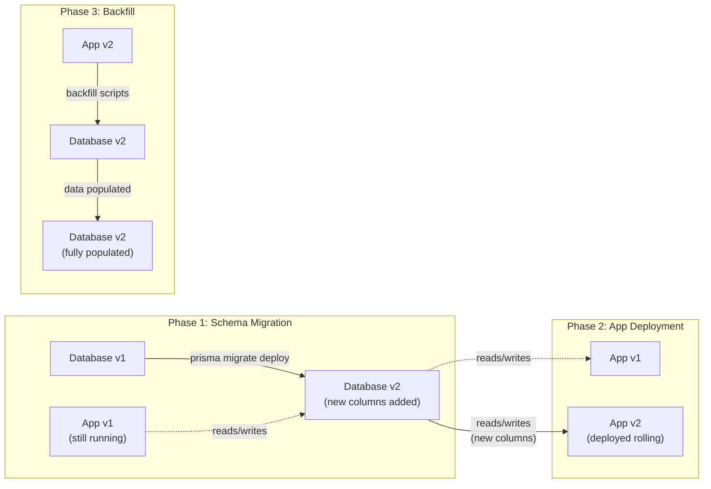
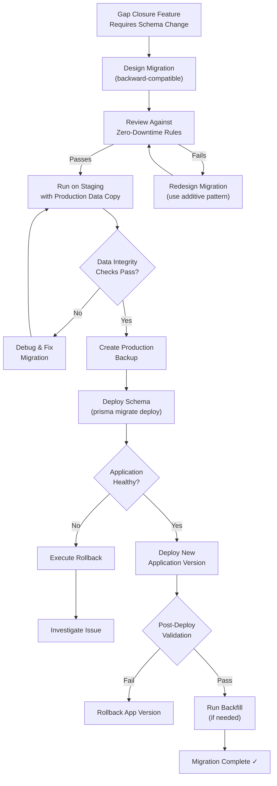

## Overview

All database migrations required for the Calendly gap closure initiative **must be deployable without application downtime**. Cal.com serves real-time scheduling traffic around the clock — any downtime means missed bookings, broken calendar integrations, and degraded trust for end users relying on the platform for their scheduling workflows.

This document defines the migration patterns, deployment strategies, rollback procedures, and validation checklists that every schema change during the gap closure effort must follow. It is the foundational migration reference for the initiative.

<Warning>
  Never propose a migration that requires application downtime or could result in data loss. All schema changes must be backward-compatible.
</Warning>

**Related Migration Guides:**

- [Data Preservation](/migration/data-preservation) — guarantees for existing user data through all migrations
- [Webhook Backward Compatibility](/migration/webhook-compatibility) — maintaining webhook consumer integrations during payload extensions

The Cal.com Prisma migration infrastructure lives in `packages/prisma/` and provides the tooling, conventions, and safety guards described throughout this document.

---

## Current Migration Infrastructure

Cal.com uses Prisma as its ORM layer with a mature, battle-tested migration system that has executed **584 chronological migrations** — from `20210605225044_init` through `20260213000000_enable_onboarding_v3_globally`. Understanding this infrastructure is essential before introducing any gap closure schema changes.

### Auto-Migration System

The auto-migration system in `packages/prisma/auto-migrations.ts` runs `yarn prisma migrate deploy` automatically during deployment and application startup. It includes multiple safety guards that prevent migrations from executing in unsafe conditions:

1. **`SKIP_DB_MIGRATIONS === "1"`** — Allows operators to skip migrations entirely during deployment if needed (e.g., for debugging or staged rollouts).
2. **`DATABASE_URL` check** — Verifies the primary database connection string is present. Without it, migrations are skipped.
3. **`DATABASE_DIRECT_URL` check** — Verifies the direct connection string (bypasses connection poolers like PgBouncer) is present. Prisma migrations require direct database access.
4. **`isPrismaAvailableCheck()`** — Executes `SELECT 1` via the Prisma client to verify database connectivity before attempting migrations.

If all guards pass, the system runs `yarn prisma migrate deploy` via `promisify(exec)`, captures stdout/stderr for logging, and exits with code 1 on failure.

`Source: packages/prisma/auto-migrations.ts`

### Prisma Availability Check

The `isPrismaAvailableCheck()` function in `packages/prisma/is-prisma-available-check.ts` verifies that the Prisma client can establish a database connection by executing a raw `SELECT 1` query. If the query succeeds, the function returns `true` and disconnects. If a `PrismaClientInitializationError` is thrown, it returns `false` — gracefully allowing the deployment to proceed without migrations rather than crashing.

`Source: packages/prisma/is-prisma-available-check.ts`

### Migration History

Each migration is a timestamped directory within `packages/prisma/migrations/` containing a `migration.sql` file with the raw SQL statements. The `migration_lock.toml` file anchors the migration system to the PostgreSQL provider. With 584 migrations spanning from June 2021 to February 2026, Cal.com has extensive precedent for safe, additive schema evolution.

### Prisma Client Configuration

The singleton Prisma client in `packages/prisma/index.ts` is configured with:

- **Optional connection pooling** via the `USE_POOL` environment variable, backed by a `PrismaPg` adapter wrapping a `pg.Pool` instance (max 5 connections, 300s idle timeout).
- **Configurable logging levels** controlled by `NEXT_PUBLIC_LOGGER_LEVEL` (levels 0–2 log everything including queries; level 3 logs info/error/warn; level 4 logs warn/error; levels 5–6 log errors only).
- **Client extensions** that enforce data safety at the ORM level:
  - `excludeLockedUsersExtension()` — Filters out locked users from queries
  - `excludePendingPaymentsExtension()` — Filters out teams with pending payments
  - `bookingIdempotencyKeyExtension()` — Ensures booking idempotency
  - `disallowUndefinedDeleteUpdateManyExtension()` — Prevents accidental mass operations with undefined filters

`Source: packages/prisma/index.ts`

### Database Scripts

The `packages/prisma/package.json` provides a comprehensive set of database lifecycle scripts:

| Script | Command | Purpose |
|--------|---------|---------|
| `db-migrate` | `yarn prisma migrate dev` | Create a new migration during development |
| `db-deploy` | `yarn prisma migrate deploy` | Deploy pending migrations to the database |
| `db-seed` | `yarn prisma db seed` | Seed the database with initial data |
| `db-up` | `docker compose up -d` | Start the local PostgreSQL container |
| `db-nuke` | `docker compose down --volumes --remove-orphans` | Destroy the local database and volumes |
| `db-reset` | `run-s db-nuke db-setup` | Full database reset (destroy + recreate) |
| `db-setup` | `run-s db-up db-deploy db-seed` | Complete local database setup |
| `generate-schemas` | `prisma generate && prisma format` | Regenerate Prisma client types |
| `build` | `ts-node --transpile-only ./auto-migrations.ts` | Run auto-migrations (used in deployment) |

`Source: packages/prisma/package.json`

### Local Development Database

The Docker Compose configuration in `packages/prisma/docker-compose.yml` provisions a PostgreSQL 13 instance on port 5450 (mapped from internal port 5432 to avoid collisions with other PostgreSQL instances). The database uses a persistent `db_data` Docker volume, trust-based authentication (`POSTGRES_HOST_AUTH_METHOD: trust`), and a `pg_isready` healthcheck with 10-second intervals.

`Source: packages/prisma/docker-compose.yml`

---

## Backward-Compatible Schema Change Patterns

The following patterns are **proven safe** across Cal.com's 584 existing migrations. Every gap closure migration must use one or more of these patterns. Each pattern includes a real SQL example from the codebase, an explanation of why it maintains zero-downtime safety, and a timing estimate.

### Pattern 1: Additive Columns with Defaults

Add a new column with a `NOT NULL` constraint and a `DEFAULT` value. Existing rows automatically receive the default value. Old application code continues to function because Prisma handles unknown fields gracefully, and new code can read both old (defaulted) and new rows.

```sql
-- Source: migration 20260210000000_add_billing_mode
ALTER TABLE "TeamBilling" ADD COLUMN "billingMode" "BillingMode" NOT NULL DEFAULT 'SEATS';
ALTER TABLE "OrganizationBilling" ADD COLUMN "billingMode" "BillingMode" NOT NULL DEFAULT 'SEATS';
```

**Why zero-downtime safe:** Existing rows get the default value instantly. The old application version does not reference this column, so reads and writes continue unaffected. The new application version reads the defaulted values for existing rows and writes the correct values for new rows.

**Timing:** O(n) where n is the row count. Fast for small tables (under 1 second). May take several seconds for large tables due to the DEFAULT value being written to every existing row.

### Pattern 2: Nullable Columns (No Default Required)

Add a new column without a `NOT NULL` constraint or `DEFAULT` value. PostgreSQL treats this as a metadata-only change — no rows are rewritten.

```sql
-- Source: migration 20260130100000_add_high_water_mark_fields
ALTER TABLE "TeamBilling" ADD COLUMN "highWaterMark" INTEGER;
ALTER TABLE "TeamBilling" ADD COLUMN "highWaterMarkPeriodStart" TIMESTAMP(3);
```

**Why zero-downtime safe:** `NULL` is the implicit default. Old application code ignores these columns entirely. New application code handles `NULL` gracefully (checking for the presence of data before using it).

**Timing:** Near-instant for PostgreSQL. Adding a nullable column without a default is a metadata-only operation — the database catalog is updated but no table data is rewritten, regardless of table size.

### Pattern 3: Nullable Text Columns

A specific case of nullable columns for text/string data. Useful for adding optional configuration fields to existing models.

```sql
-- Source: migration 20260201053520_add_redirect_url_on_no_routing_form_response
ALTER TABLE "public"."EventType" ADD COLUMN "redirectUrlOnNoRoutingFormResponse" TEXT;
```

**Why zero-downtime safe:** The `TEXT` column has no `NOT NULL` constraint. All existing `EventType` rows receive `NULL` for this field. Application code must handle the `NULL` case, returning either a default behavior or skipping the redirect logic when the value is absent.

**Timing:** Near-instant (metadata-only change).

### Pattern 4: Enum Creation and Column Addition

Create a new PostgreSQL enum type and use it in a new column. The enum creation is a catalog-only operation that does not touch any existing table data.

```sql
-- Source: migration 20260210000000_add_billing_mode
CREATE TYPE "BillingMode" AS ENUM ('SEATS', 'ACTIVE_USERS');
ALTER TABLE "TeamBilling" ADD COLUMN "billingMode" "BillingMode" NOT NULL DEFAULT 'SEATS';
```

**Why zero-downtime safe:** Creating a new enum type is a catalog operation — it has no impact on existing tables or data. The subsequent column addition with a default value follows Pattern 1 (additive column with default).

**Timing:** Enum creation is instant. Column addition timing follows Pattern 1 (O(n) for the default value write).

### Pattern 5: Feature Flag Gating

Insert a new feature flag row into the `Feature` table with `enabled = false` by default and an `ON CONFLICT DO NOTHING` clause to prevent duplicate errors during re-deployments.

```sql
-- Source: migration 20260210000000_add_billing_mode
INSERT INTO "Feature" ("slug", "enabled", "type", "description", "createdAt", "updatedAt")
VALUES ('active-user-billing', false, 'OPERATIONAL', 'Enable active-user-based billing', CURRENT_TIMESTAMP, CURRENT_TIMESTAMP)
ON CONFLICT ("slug") DO NOTHING;
```

**Why zero-downtime safe:** New features are disabled by default — no user-facing behavior changes until the flag is explicitly enabled. The `ON CONFLICT DO NOTHING` clause ensures idempotent execution; running the migration multiple times (or on a database that already has the flag) does not cause errors.

**Timing:** Instant (single row insert into a small table).

### Pattern 6: Data Update Migrations

Update existing rows in a table to change configuration or enable features. These migrations do not alter the schema structure.

```sql
-- Source: migration 20260213000000_enable_onboarding_v3_globally
UPDATE "Feature" SET "enabled" = true, "updatedAt" = CURRENT_TIMESTAMP WHERE "slug" = 'onboarding-v3';
```

**Why zero-downtime safe:** Only modifies an existing row in the `Feature` table. No schema changes, no new columns, no constraint modifications. The application reads the updated value on the next query.

**Timing:** Instant (single row update with indexed `slug` lookup).

### Pattern 7: Concurrent Index Creation

For large tables, standard `CREATE INDEX` acquires a lock that blocks writes for the duration of the index build. PostgreSQL provides `CREATE INDEX CONCURRENTLY` which builds the index without blocking concurrent DML operations.

```sql
-- Pattern for zero-downtime index creation
CREATE INDEX CONCURRENTLY "idx_booking_start_time" ON "Booking" ("startTime");
```

<Note>
  Prisma migrations run inside a transaction by default. `CREATE INDEX CONCURRENTLY` cannot execute inside a transaction. For large table index creation, this requires manual migration management outside Prisma's default transaction wrapper — either by using a raw SQL migration file with a `-- CreateIndex` comment that Prisma recognizes, or by running the index creation as a separate operational step outside the Prisma migration pipeline.
</Note>

**Why zero-downtime safe:** The `CONCURRENTLY` flag allows the index to be built while the table remains fully available for reads and writes. The trade-off is longer build time and the possibility of a failed index build requiring cleanup.

**Timing:** Depends on table size. Small tables: under 1 second. Medium tables (10K–1M rows): 1–60 seconds. Large tables (over 1M rows): 1–60 minutes, but non-blocking.

---

## Blue-Green Migration Approach

The recommended deployment strategy for gap closure schema changes follows a three-phase blue-green approach that ensures both old and new application versions can coexist against the same database.

<Steps>
  <Step title="Phase 1: Schema Migration (backward-compatible changes only)">
    Deploy the new Prisma migration to the database using `prisma migrate deploy`. The **old** application version (App v1) continues running against the **updated** schema (Database v2). Because all changes are additive — new nullable columns, new enums with defaults, new feature flags — the old code is completely unaffected.
  </Step>
  <Step title="Phase 2: Application Deployment (rolling update)">
    Deploy the new application version (App v2) that utilizes the new schema columns. During rolling deployment, both App v1 and App v2 instances coexist briefly. Both versions can read from and write to the updated schema because all changes are backward-compatible.
  </Step>
  <Step title="Phase 3: Backfill (if needed)">
    If any new columns require existing data to be populated (beyond the default values), run data backfill scripts as background tasks. These do not block the application and can be executed incrementally using the `DATABASE_CHUNK_SIZE` environment variable for batch processing.
  </Step>
</Steps>



---

## Anti-Patterns: What NOT to Do

The following migration operations are **strictly prohibited** during the gap closure initiative because they break zero-downtime guarantees.

<Warning>
  **NEVER rename columns.** Existing application code references old column names. During a rolling deployment, the old application version will fail to read or write data if a column has been renamed.
</Warning>

**Safe alternative:** Add a new column with the desired name, backfill data from the old column, update application code to use the new column, then drop the old column in a **future** migration after all application instances have been updated.

<Warning>
  **NEVER change column types.** For example, changing `VARCHAR` to `INTEGER` breaks existing queries and application code that expects the original type.
</Warning>

**Safe alternative:** Add a new column with the desired type, migrate data with type conversion, update application code, then drop the old column in a future migration.

<Warning>
  **NEVER add NOT NULL columns without defaults.** Existing rows will violate the new constraint, causing the migration to fail or the database to reject writes from old application instances.
</Warning>

**Safe alternative:** Add the column as nullable first (Pattern 2), backfill existing rows, then add the `NOT NULL` constraint in a separate migration after all rows have been populated.

<Warning>
  **NEVER drop columns in the same deployment as code changes.** During rolling deployment, old application instances still reference those columns. Dropping a column before all old instances are terminated causes runtime errors.
</Warning>

**Safe alternative:** Remove all code references to the column first, deploy that change, then drop the column in a future migration after confirming no application instances use it.

<Warning>
  **NEVER use `DROP TABLE` for tables with active foreign keys.** This causes cascading deletes or constraint violations that can destroy related data across multiple tables.
</Warning>

**Safe alternative:** Remove foreign key references first, verify no application code references the table, then drop the table in a future migration with explicit confirmation.

<Warning>
  **NEVER rename or remove enum values.** Existing rows that use the old enum value will become invalid, and queries filtering by the old value will break.
</Warning>

**Safe alternative:** Add new enum values alongside old ones, migrate data to use the new values, then deprecate (but never remove) the old values.

---

## Rollback Procedures

Every migration during the gap closure initiative must have a documented rollback strategy. The following procedures cover schema rollback, application rollback, and full recovery.

### Schema Rollback

Prisma does not natively support `migrate down` (reverse migrations). Rollback requires manually executing SQL to undo the migration changes.

For **additive changes** (new nullable columns, new columns with defaults, new enum types): No schema rollback is typically needed. The new columns and types do not affect old application code — they are simply ignored by the previous application version.

For **complex changes** that require rollback: Prepare a rollback SQL script alongside each migration and test it in staging before production deployment.

```sql
-- Example rollback: remove a newly added column and enum type
ALTER TABLE "TeamBilling" DROP COLUMN IF EXISTS "billingMode";
DROP TYPE IF EXISTS "BillingMode";
```

<Warning>
  Always test rollback scripts in a staging environment with production-representative data before deploying to production. Untested rollback scripts may fail due to data dependencies, foreign key constraints, or index dependencies.
</Warning>

### Application Rollback

Rolling deployments inherently support application rollback:

1. Revert to the previous application version using your deployment platform's rollback capability (Vercel instant rollback, Docker image tag revert, or Kubernetes deployment rollback).
2. Because all schema changes are backward-compatible, the old application version works correctly against the updated schema.
3. No database changes are required for application-only rollback.

### Full Rollback (Nuclear Option)

If both schema and application changes must be reversed:

1. Restore the database from the pre-migration backup (see [Data Preservation](/migration/data-preservation) for backup procedures).
2. Deploy the previous application version.
3. Verify database connectivity with a `SELECT 1` check (mirroring `isPrismaAvailableCheck()`).

<Warning>
  Full rollback is the last resort. Restoring from a backup will lose any data created after the backup was taken — including new bookings, event type changes, and webhook subscriptions created during the migration window. Only use this if schema rollback and application rollback are insufficient.
</Warning>

---

## Migration Pipeline Flow

Every gap closure feature that requires a schema change must pass through the following pipeline. This diagram represents the end-to-end flow from feature design through production deployment and validation.



The pipeline enforces a strict review gate: any migration that fails the zero-downtime rule review must be redesigned using the backward-compatible patterns documented above before it can proceed to staging.

---

## Timing Estimates

The following table provides approximate timing estimates for common migration operations at various table sizes. Use these estimates for production deployment planning and maintenance window coordination.

| Operation Type | Small Table (&lt;10K rows) | Medium Table (10K–1M rows) | Large Table (&gt;1M rows) |
|---|---|---|---|
| Add nullable column | &lt; 1s | &lt; 1s | &lt; 1s (metadata only) |
| Add column with default | &lt; 1s | 1–10s | 10s–5min |
| Create new enum type | &lt; 1s | &lt; 1s | &lt; 1s |
| Create index (standard) | &lt; 1s | 1–30s | 1–30min |
| Create index (`CONCURRENTLY`) | &lt; 1s | 1–60s | 1–60min (non-blocking) |
| Data backfill `UPDATE` | &lt; 1s | 1–60s | 1min–30min |
| Feature flag `INSERT` | &lt; 1s | &lt; 1s | &lt; 1s |

<Note>
  These are approximate estimates. Actual timing depends on hardware specifications, concurrent load on the database, table structure (number of indexes, constraints, triggers), and network latency to the database server. Always benchmark against a production-representative dataset before scheduling a production migration window.
</Note>

Key observations for Cal.com's schema:

- **`Booking` table** — Likely the largest table in most deployments. Index creation and backfill operations should use `CONCURRENTLY` and batched updates respectively.
- **`EventType` table** — Moderate size. Column additions are fast, but index creation should be benchmarked.
- **`Feature` table** — Small table (under 100 rows typically). All operations are instant.
- **`TeamBilling` / `OrganizationBilling` tables** — Small tables. All operations are instant.
- **`Credential` table** — Contains encrypted data. Timing depends on number of connected calendars across all users.

---

## Gap Closure Migration Checklist

Use this checklist for **every** migration during the Calendly gap closure initiative. Every item must be verified before the migration is approved for production deployment.

<AccordionGroup>
  <Accordion title="Pre-Migration Verification">
    - Migration uses only backward-compatible patterns (additive columns, nullable fields, enums with defaults)
    - Rollback SQL script prepared and tested in staging
    - Migration tested against staging database with production-representative data
    - Row counts verified before and after migration for all affected tables
    - Encrypted credentials still decryptable after migration (verify `CALENDSO_ENCRYPTION_KEY` compatibility)
    - Timing estimates documented for production-scale table sizes
  </Accordion>
  <Accordion title="Deployment Verification">
    - Application health checks pass with **old** code against **new** schema
    - Application health checks pass with **new** code against **new** schema
    - Database backup taken immediately before production deployment (see [Data Preservation](/migration/data-preservation))
    - Monitoring alerts configured for the migration window (error rates, response latencies, database connection counts)
  </Accordion>
  <Accordion title="Post-Migration Verification">
    - Feature flags used for new functionality (disabled by default until verified)
    - Booking creation flow tested end-to-end
    - Calendar integration sync verified (credential decryption working)
    - Webhook delivery tested (see [Webhook Backward Compatibility](/migration/webhook-compatibility))
    - No orphaned records or broken foreign key references
  </Accordion>
</AccordionGroup>

**Quick reference checklist for copy-paste into migration PRs:**

```
- [ ] Migration uses only backward-compatible patterns (additive columns, nullable fields, enums with defaults)
- [ ] Rollback SQL script prepared and tested
- [ ] Migration tested against staging database with production-representative data
- [ ] Row counts verified before and after migration
- [ ] Encrypted credentials still decryptable after migration
- [ ] Application health checks pass with old code against new schema
- [ ] Application health checks pass with new code against new schema
- [ ] Timing estimates documented for production scale
- [ ] Backup taken before production deployment
- [ ] Monitoring alerts configured for migration window
- [ ] Feature flags used for new functionality (disabled by default)
```
