## Introduction

This catalog is the **comprehensive registry of all identified gaps** from the eight domain-specific gap analyses conducted as part of the Calendly parity assessment. Each gap is formalized as an **epic** — a discrete, trackable unit of work with a stable identifier, priority classification, complexity estimate, dependency chain, and cross-reference to the originating gap report.

**Key cross-references:**

- **[Gap Report Overview](/gap-report/overview)** — Executive summary and feature domain matrix that identifies all gaps cataloged here
- **[Sprint Roadmap Overview](/sprint-roadmap/overview)** — Sequencing methodology, sprint structure, and autonomous execution protocol for closing these gaps
- **[Validation Criteria](/sprint-roadmap/validation-criteria)** — Behavioral acceptance criteria, regression test requirements, and integration verification checklists for each epic

All gap analysis in this catalog uses **Calendly's API documentation at [developer.calendly.com](https://developer.calendly.com)** as the behavioral source of truth for expected scheduling platform behavior. Epic IDs are **stable identifiers** used consistently across the sprint roadmap, gap reports, implementation specs, pull requests, and validation reports.

<Note>
  Epic IDs use the format `{DOMAIN}-{NUMBER}` (e.g., `AV-001` for Availability domain). These IDs are stable and should be referenced in implementation specs, PRs, and validation reports.
</Note>

---

## Epic ID Convention

Every epic is assigned a unique identifier following the format **`{DOMAIN_PREFIX}-{SEQUENTIAL_NUMBER}`**, where the domain prefix maps to one of the eight gap analysis domains.

| Prefix | Domain | Gap Report Reference |
|--------|--------|---------------------|
| `AV` | Availability & Scheduling | [Availability & Scheduling](/gap-report/availability-scheduling) |
| `ET` | Event Types | [Event Types](/gap-report/event-types) |
| `CI` | Calendar Integrations | [Calendar Integrations](/gap-report/calendar-integrations) |
| `WH` | Webhooks & Events | [Webhooks & Events](/gap-report/webhooks-events) |
| `RF` | Routing Forms | [Routing Forms](/gap-report/routing-forms) |
| `EM` | Embed & Share | [Embed & Share](/gap-report/embed-share) |
| `AG` | Admin & Teams | [Admin & Teams](/gap-report/admin-teams) |
| `NF` | Notifications | [Notifications](/gap-report/notifications) |

Sequential numbers start at `001` within each domain and increment monotonically. IDs are never reused — if an epic is removed, its ID is retired.

---

## Priority Classification

All epics use a **4-level priority scale** that aligns directly with the gap severity classification used throughout the [Gap Report](/gap-report/overview) domain analyses.

| Priority | Definition | Action |
|----------|-----------|--------|
| **Critical** | Blocks Calendly parity. Calendly has a core capability that Cal.com completely lacks. | Must be addressed first. No sprint gate passes without resolving all Critical epics in scope. |
| **High** | Significant behavioral gap. Feature exists in Cal.com but behavior differs materially from Calendly. | Important for parity. Should be addressed in early sprints. |
| **Medium** | Minor behavioral difference. Feature exists with slight behavioral deviations. | Should be addressed but not blocking. Schedule in mid-to-late sprints. |
| **Low** | Cosmetic or edge case. Negligible difference in user experience. | Can be deferred to final polish sprints or backlogged. |

<Note>
  Priority classification aligns with the gap severity scale used throughout the Gap Report domain analyses. A "High" priority epic corresponds to a "High" severity gap in the domain report.
</Note>

---

## Complexity Estimation

Each epic includes a complexity estimate using a **4-level T-shirt sizing scale** that accounts for the number of packages affected, architectural impact, and estimated implementation effort.

| Size | Label | Scope | Estimated Effort |
|------|-------|-------|-----------------|
| **S** | Small | Isolated change within a single package | Less than 1 day |
| **M** | Medium | Cross-package change affecting 2–3 packages | 1–3 days |
| **L** | Large | Multi-package change requiring schema migration or new architecture | 3–5 days |
| **XL** | Extra Large | Major architectural change spanning 5+ packages, potentially introducing a new subsystem | 5+ days |

<Info>
  Complexity estimates are approximate and intended for sprint planning purposes. Actual effort may vary based on codebase familiarity, testing requirements, and the scope of behavioral alignment needed.
</Info>

---

## Epic Registries by Domain

The following sections contain the complete epic registry for each of the eight gap analysis domains. Each registry table uses consistent columns and cross-references the originating gap report.

<AccordionGroup>

<Accordion title="Availability & Scheduling (AV-*)" icon="clock">

### Availability & Scheduling Epics

Gap Report: [Availability & Scheduling](/gap-report/availability-scheduling)

Cal.com's availability engine is implemented across `packages/features/schedules/` (`ScheduleService`, `ScheduleRepository`), `packages/features/availability/` (slot generation, DST normalization via `date-ranges.ts`), and `packages/features/busyTimes/` (busy time aggregation). The engine supports multiple named schedules, per-schedule timezones, travel timezone overrides, country-based holiday blocking, and a sophisticated slot generation pipeline.

`Source: packages/features/schedules/services/ScheduleService.ts`
`Source: packages/features/schedules/lib/date-ranges.ts`

| Epic ID | Title | Priority | Complexity | Dependencies | Cal.com Package |
|---------|-------|----------|------------|-------------|----------------|
| **AV-001** | Weekly schedule configuration parity with Calendly | Medium | M | None | `packages/features/schedules/` |
| **AV-002** | Date-specific override behavior alignment | Medium | M | AV-001 | `packages/features/availability/` |
| **AV-003** | Buffer time (before/after) configuration parity | Medium | S | AV-001 | `packages/features/availability/` |
| **AV-004** | Minimum scheduling notice parity | Medium | S | AV-001 | `packages/features/availability/` |
| **AV-005** | Maximum advance booking window parity | Medium | S | AV-001 | `packages/features/availability/` |
| **AV-006** | DST normalization verification for Calendly-equivalent behavior | High | M | AV-001 | `packages/features/schedules/lib/date-ranges.ts` |
| **AV-007** | Holiday blocking behavior parity | Low | S | AV-001 | `packages/features/holidays/` |

<Info>
  **Cal.com Advantages:** Cal.com exceeds Calendly in this domain with travel timezone overrides (no Calendly equivalent), programmatic availability management via API v2 (Calendly's API does not support this), multiple named schedules per user, per-schedule timezones, and country-based holiday blocking with per-user opt-out.
</Info>

</Accordion>

<Accordion title="Event Types (ET-*)" icon="calendar">

### Event Type Epics

Gap Report: [Event Types](/gap-report/event-types)

Cal.com implements six scheduling paradigms through the `SchedulingType` Prisma enum (`ROUND_ROBIN`, `COLLECTIVE`, `MANAGED`) plus implicit one-on-one (default when no type is set), group (via `seatsPerTimeSlot`), and dynamic (ad-hoc meeting links). The `IEventTypesRepository` interface and `PrismaEventTypeRepository` provide the persistence layer for event type CRUD operations.

`Source: packages/features/eventtypes/eventtypes.repository.interface.ts`
`Source: packages/features/eventtypes/repositories/eventTypeRepository.ts`
`Source: packages/prisma/schema.prisma (enum SchedulingType)`

| Epic ID | Title | Priority | Complexity | Dependencies | Cal.com Package | Status |
|---------|-------|----------|------------|-------------|----------------|--------|
| **ET-001** | 1:1 event type behavioral parity | Medium | M | AV-001 | `packages/features/eventtypes/` | ✅ Completed (Sprint 2) — verified against ET-VAL-001 |
| **ET-002** | Group event type parity (seatsPerTimeSlot) | Medium | M | ET-001 | `packages/features/eventtypes/` | ✅ Completed (Sprint 2) — verified against ET-VAL-002 |
| **ET-003** | Round-robin distribution parity | High | L | ET-001 | `packages/features/eventtypes/` | ✅ Completed (Sprint 2) — verified against ET-VAL-003 |
| **ET-004** | Collective scheduling parity | Medium | M | ET-001 | `packages/features/eventtypes/` | ✅ Completed (Sprint 2) — verified against ET-VAL-004 |
| **ET-005** | Booking window configuration alignment | Medium | S | AV-005 | `packages/features/eventtypes/` | ✅ Completed (Sprint 2) — verified against ET-VAL-006 |
| **ET-006** | Custom fields/questions parity | Low | M | ET-001 | `packages/features/eventtypes/` | ✅ Completed (Sprint 2) — verified against ET-VAL-005 |

<Info>
  **Cal.com Advantages:** Cal.com offers **6 scheduling paradigms** vs. Calendly's **4 types**. Additional Cal.com-exclusive capabilities include managed event types (`SchedulingType.MANAGED`) for admin-pushed templates, dynamic ad-hoc meeting links, and full **programmatic event type creation via API v2** — Calendly's API does NOT support programmatic event type creation.
</Info>

</Accordion>

<Accordion title="Calendar Integrations (CI-*)" icon="calendar-check">

### Calendar Integration Epics

Gap Report: [Calendar Integrations](/gap-report/calendar-integrations)

Cal.com implements a pluggable calendar adapter architecture through `packages/app-store/`, where each calendar provider is an independent adapter implementing the shared `Calendar` interface. The three primary adapters in scope are Google Calendar (OAuth2 + Google Calendar API v3), Outlook/Office 365 (OAuth2 + Microsoft Graph API), and Apple Calendar (CalDAV protocol with iCloud).

`Source: packages/app-store/googlecalendar/lib/CalendarService.ts`
`Source: packages/app-store/office365calendar/lib/CalendarService.ts`
`Source: packages/app-store/applecalendar/lib/CalendarService.ts`

| Epic ID | Title | Priority | Complexity | Dependencies | Cal.com Package | Status |
|---------|-------|----------|------------|-------------|----------------|--------|
| **CI-001** | Google Calendar sync behavioral parity | Medium | M | AV-001 | `packages/app-store/googlecalendar/` | ✅ Completed |
| **CI-002** | Outlook/Office 365 sync behavioral parity | Medium | M | AV-001 | `packages/app-store/office365calendar/` | ✅ Completed |
| **CI-003** | iCloud/Apple Calendar sync parity | Medium | M | AV-001 | `packages/app-store/applecalendar/` | ✅ Completed |
| **CI-004** | Conflict detection behavior alignment | High | L | CI-001, CI-002, CI-003 | `packages/features/calendars/` | ✅ Completed |
| **CI-005** | Bi-directional sync verification | High | L | CI-001, CI-002 | `packages/features/calendars/` | ✅ Completed |

<Info>
  **Cal.com Advantages:** Cal.com provides **11+ calendar adapters** vs. Calendly's **3 native integrations** (Google, Outlook, iCloud). Additional adapters include CalDAV, Exchange 2013/2016, Lark, Feishu, Zoho, and ICS Feed. Cal.com also provides **AES-256 credential encryption** for all stored OAuth tokens and calendar credentials, per-event-type calendar selection, and multi-calendar busy time aggregation.

  All Calendar Integration epics CI-001 through CI-005 have been completed in Sprint 3. CI-005 (Bi-directional sync verification) is verified via `packages/features/calendars/lib/__tests__/bidirectionalSync.integration.test.ts` (844 lines) covering create, reschedule, and cancel flows for Google and Outlook adapters. Two additional gap closures have been implemented behind feature flags: calendar-driven cancellation sync (`CalendarCancellationSyncService`, `GoogleCancellationHandler`, `OutlookCancellationHandler` — gated behind `calendar-cancellation-sync`) and buffer time visualization (`BufferTimeEventService`, `CalendarEventBuilder.buildBufferEvent()` — gated behind `calendar-buffer-sync`). Gate 3 validation is complete.
</Info>

</Accordion>

<Accordion title="Webhooks & Events (WH-*)" icon="webhook">

### Webhook & Event Epics

Gap Report: [Webhooks & Events](/gap-report/webhooks-events)

Cal.com's webhook system defines **20 distinct `WebhookTriggerEvents`** in the Prisma schema, orchestrated through `WebhookService`, `WebhookNotifier`, `WebhookNotificationHandler`, and the versioned `PayloadBuilderFactory`. The system supports HMAC-SHA256 signature verification (`X-Cal-Signature-256`), Handlebars-based custom payload templates, and Tasker-enabled async delivery.

`Source: packages/prisma/schema.prisma (enum WebhookTriggerEvents)`
`Source: packages/features/webhooks/lib/factory/versioned/PayloadBuilderFactory.ts`
`Source: packages/features/webhooks/lib/dto/types.ts`

**Cal.com's 20 WebhookTriggerEvents:**

`BOOKING_CREATED` · `BOOKING_PAYMENT_INITIATED` · `BOOKING_PAID` · `BOOKING_RESCHEDULED` · `BOOKING_REQUESTED` · `BOOKING_CANCELLED` · `BOOKING_REJECTED` · `BOOKING_NO_SHOW_UPDATED` · `FORM_SUBMITTED` · `MEETING_ENDED` · `MEETING_STARTED` · `RECORDING_READY` · `INSTANT_MEETING` · `RECORDING_TRANSCRIPTION_GENERATED` · `OOO_CREATED` · `AFTER_HOSTS_CAL_VIDEO_NO_SHOW` · `AFTER_GUESTS_CAL_VIDEO_NO_SHOW` · `FORM_SUBMITTED_NO_EVENT` · `DELEGATION_CREDENTIAL_ERROR` · `WRONG_ASSIGNMENT_REPORT`

**Calendly's 3 Webhook Events:** `invitee.created` · `invitee.canceled` · `routing_form_submission.created`

| Epic ID | Title | Priority | Complexity | Dependencies | Cal.com Package | Status |
|---------|-------|----------|------------|-------------|----------------|--------|
| **WH-001** | Webhook event mapping for Calendly `invitee.created` equivalents | High | M | ET-001 | `packages/features/webhooks/` | 🔄 In Progress (Sprint 4) — targets WH-VAL-001, WH-VAL-005 |
| **WH-002** | Webhook event mapping for Calendly `invitee.canceled` equivalents | High | M | WH-001 | `packages/features/webhooks/` | 🔄 In Progress (Sprint 4) — targets WH-VAL-002, WH-VAL-005 |
| **WH-003** | Routing form submission webhook parity (`routing_form_submission.created`) | Medium | M | RF-001 | `packages/features/webhooks/` | 🔄 In Progress (Sprint 4) — targets WH-VAL-004, RF-VAL-005 |
| **WH-004** | Payload structure alignment with Calendly expectations | High | L | WH-001 | `packages/features/webhooks/lib/factory/` | 🔄 In Progress (Sprint 4) — targets WH-VAL-006, WH-VAL-007 |
| **WH-005** | Webhook versioning strategy for gap closure additions | Medium | L | WH-004 | `packages/features/webhooks/lib/factory/versioned/` | 🔄 In Progress (Sprint 4) — targets WH-VAL-006, WH-VAL-009 |

<Info>
  **Cal.com Advantages:** Cal.com supports **20 WebhookTriggerEvents** vs. Calendly's **3 events** — a 6.7x coverage advantage. Additional Cal.com-exclusive capabilities include the versioned `PayloadBuilderFactory` (currently `v2021-10-20` with extensible factory dispatch), `X-Cal-Signature-256` HMAC-SHA256 verification (Calendly lacks native webhook signing), Handlebars-based custom payload templates, Tasker async delivery, and multi-scope webhook subscriptions (event-type, team, organization, and platform OAuth client).
</Info>

</Accordion>

<Accordion title="Routing Forms (RF-*)" icon="route">

### Routing Form Epics

Gap Report: [Routing Forms](/gap-report/routing-forms)

Cal.com's routing forms use a React Awesome Query Builder (RAQB) rule engine with `jsonLogic`-based conditional evaluation in `processRoute.tsx` (which exports the `findMatchingRoute` function). The system supports attribute-based team member matching, CRM contact owner lookups (Salesforce, HubSpot), multiple route action types (`eventTypeRedirectUrl`, `customPageMessage`, `externalRedirectUrl`), and an API v2 controller for programmatic slot calculation.

`Source: packages/app-store/routing-forms/lib/processRoute.tsx`
`Source: packages/app-store/routing-forms/README.md`

| Epic ID | Title | Priority | Complexity | Dependencies | Cal.com Package | Status |
|---------|-------|----------|------------|-------------|----------------|--------|
| **RF-001** | Routing form builder behavioral parity | Medium | M | ET-001 | `packages/features/routing-forms/` | 🔄 In Progress (Sprint 5) — targets RF-VAL-001 |
| **RF-002** | Conditional routing logic alignment | Medium | L | RF-001 | `packages/app-store/routing-forms/lib/processRoute.tsx` | 🔄 In Progress (Sprint 5) — targets RF-VAL-002, RF-VAL-003 |
| **RF-003** | Form field type parity | Low | S | RF-001 | `packages/features/routing-forms/` | 🔄 In Progress (Sprint 5) — targets RF-VAL-001 |
| **RF-004** | Routing form API v2 endpoint parity | Medium | M | RF-001 | `apps/api/v2/src/modules/routing-forms/` | 🔄 In Progress (Sprint 5) — targets RF-VAL-006 |

<Info>
  **Cal.com Advantages:** Cal.com's RAQB-based conditional routing engine is **significantly more advanced** than Calendly's form-answer-based routing. Cal.com supports arbitrarily complex boolean logic via `jsonLogic`, attribute-based team member matching, CRM lookup integration (Salesforce, HubSpot) for contact owner routing, nested router chaining, and programmatic API v2 endpoints for slot calculation — none of which Calendly provides.
</Info>

</Accordion>

<Accordion title="Embed & Share (EM-*)" icon="code">

### Embed & Share Epics

Gap Report: [Embed & Share](/gap-report/embed-share)

Cal.com implements embedding through a three-package modular architecture: `embed-core` (vanilla JS with iframe bootstrap, `Cal.inline()`, `Cal.modal()`, `Cal.floatingButton()`), `embed-react` (React wrapper with `Cal` component and `useEmbed` hook), and `embed-snippet` (lightweight JS loader with command queue). The system supports a `postMessage` handshake protocol, prerendering, skeleton loaders, namespace-based multi-embed isolation, and prefill capabilities.

`Source: packages/embeds/README.md`
`Source: packages/embeds/LIFECYCLE.md`

| Epic ID | Title | Priority | Complexity | Dependencies | Cal.com Package | Status |
|---------|-------|----------|------------|-------------|----------------|--------|
| **EM-001** | Inline embed behavioral parity | Medium | M | ET-001 | `packages/embeds/embed-core/` | 🔄 In Progress (Sprint 6) — targets EM-VAL-001 |
| **EM-002** | Modal/popup embed parity | Medium | M | EM-001 | `packages/embeds/embed-core/` | 🔄 In Progress (Sprint 6) — targets EM-VAL-002 |
| **EM-003** | Floating button embed parity | Low | S | EM-001 | `packages/embeds/embed-core/` | 🔄 In Progress (Sprint 6) — targets EM-VAL-003 |
| **EM-004** | Share flow and link generation parity | Medium | M | ET-001 | `packages/embeds/` | 🔄 In Progress (Sprint 6) — targets EM-VAL-004, EM-VAL-005 |

<Info>
  **Cal.com Advantages:** Cal.com provides a **3-package modular embed suite** (`embed-core`, `embed-react`, `embed-snippet`) vs. Calendly's single embeddable widget. Cal.com-exclusive capabilities include the `postMessage` handshake protocol for parent-iframe communication, prerendering for instant load times, skeleton loaders for perceived performance, namespace-based multi-embed support on a single page, and a first-party React component — none of which Calendly offers natively.
</Info>

</Accordion>

<Accordion title="Admin & Teams (AG-*)" icon="building">

### Admin & Team Management Epics

Gap Report: [Admin & Teams](/gap-report/admin-teams)

Cal.com's admin governance spans `packages/features/ee/organizations/` (organization onboarding, settings, billing, slug management), `packages/features/ee/teams/` (team management with hierarchical sub-teams), and `packages/features/membership/` (invitation workflows, role assignment, membership lifecycle). The system implements Permission-Based Access Control (PBAC) for fine-grained authorization.

`Source: packages/features/ee/organizations/`
`Source: packages/features/ee/teams/lib/types.ts`
`Source: packages/features/membership/services/membershipService.ts`

| Epic ID | Title | Priority | Complexity | Dependencies | Cal.com Package | Status |
|---------|-------|----------|------------|-------------|----------------|--------|
| **AG-001** | Admin role model parity with Calendly admin/owner/user | Medium | M | None | `packages/features/ee/organizations/` | 🔄 In Progress (Sprint 7) — targets AG-VAL-001, AG-VAL-006 |
| **AG-002** | Team event routing behavioral parity | High | L | AG-001, ET-003 | `packages/features/ee/teams/` | 🔄 In Progress (Sprint 7) — targets AG-VAL-003 |
| **AG-003** | Managed event type push behavior parity | Medium | M | AG-001, ET-001 | `packages/features/eventtypes/` | 🔄 In Progress (Sprint 7) — targets AG-VAL-004 |
| **AG-004** | Member invitation workflow parity | Low | S | AG-001 | `packages/features/membership/` | 🔄 In Progress (Sprint 7) — targets AG-VAL-005 |

<Info>
  **Cal.com Advantages:** Cal.com implements a **hierarchical organization structure** with sub-teams, custom roles, and PBAC fine-grained permissions — Calendly uses a flatter organization with five fixed roles (Owner, Admin, Manager, Member, Viewer) and no sub-organization capability. Additional Cal.com advantages include SSO/SCIM integration for enterprise provisioning, managed event types pushed from admin to members, and programmatic organization management via API.
</Info>

</Accordion>

<Accordion title="Notifications (NF-*)" icon="bell">

### Notification Flow Epics

Gap Report: [Notifications](/gap-report/notifications)

Cal.com's notification infrastructure spans three primary packages: `packages/emails/` (centralized email manager with 15+ dispatch functions, multi-provider support via SMTP/SendGrid/Resend), `packages/sms/` (Twilio-powered SMS and WhatsApp with rate limiting and credit gating), and `packages/features/ee/workflows/` (trigger-action automation pipelines for scheduled reminders, follow-ups, and cancellation notices).

`Source: packages/emails/email-manager.ts`
`Source: packages/sms/sms-manager.ts`

| Epic ID | Title | Priority | Complexity | Dependencies | Cal.com Package | Status |
|---------|-------|----------|------------|-------------|----------------|--------|
| **NF-001** | Booking confirmation email parity | High | M | ET-001 | `packages/emails/` | 🔄 In Progress (Sprint 8) — targets NF-VAL-001, NF-VAL-002, NF-VAL-008 |
| **NF-002** | Reminder email/SMS parity with Calendly | High | M | NF-001 | `packages/emails/`, `packages/sms/` | 🔄 In Progress (Sprint 8) — targets NF-VAL-003, NF-VAL-004 |
| **NF-003** | Follow-up notification parity | Medium | M | NF-001 | `packages/emails/` | 🔄 In Progress (Sprint 8) — targets NF-VAL-006, NF-VAL-009 |
| **NF-004** | Cancellation notification parity | High | M | NF-001 | `packages/emails/` | 🔄 In Progress (Sprint 8) — targets NF-VAL-005 |
| **NF-005** | SMS reminder configuration parity | Medium | M | NF-002 | `packages/sms/sms-manager.ts` | Planned |

<Info>
  **Cal.com Advantages:** Cal.com provides **multi-provider email dispatch** (SMTP, SendGrid, Resend) vs. Calendly's single-provider approach. Additional capabilities include WhatsApp messaging via Twilio, workflow automation with time-based scheduling (`packages/features/ee/workflows/`), ICS calendar attachments on all booking emails, organization-level email governance, and SMS credit gating — none of which Calendly's basic notification system supports at comparable depth.
</Info>

</Accordion>

</AccordionGroup>

---

## Epic Dependency Graph

The following directed acyclic graph (DAG) visualizes all epic dependencies across domains. Arrows indicate that the source epic must be completed before the target epic can begin. **Availability & Scheduling (AV)** is the foundational domain — most other domains depend on availability infrastructure being parity-verified first.

```mermaid
flowchart TD
    subgraph AV["Availability & Scheduling"]
        AV001["AV-001\nWeekly Schedules"]
        AV002["AV-002\nDate Overrides"]
        AV003["AV-003\nBuffer Times"]
        AV004["AV-004\nMin Notice"]
        AV005["AV-005\nMax Advance"]
        AV006["AV-006\nDST Handling"]
        AV007["AV-007\nHoliday Blocking"]
        AV001 --> AV002
        AV001 --> AV003
        AV001 --> AV004
        AV001 --> AV005
        AV001 --> AV006
        AV001 --> AV007
    end

    subgraph ET["Event Types"]
        ET001["ET-001\n1:1 Events"]
        ET002["ET-002\nGroup Events"]
        ET003["ET-003\nRound-Robin"]
        ET004["ET-004\nCollective"]
        ET005["ET-005\nBooking Windows"]
        ET006["ET-006\nCustom Fields"]
        ET001 --> ET002
        ET001 --> ET003
        ET001 --> ET004
        ET001 --> ET006
    end

    subgraph CI["Calendar Integrations"]
        CI001["CI-001\nGoogle Calendar"]
        CI002["CI-002\nOutlook/O365"]
        CI003["CI-003\niCloud/Apple"]
        CI004["CI-004\nConflict Detection"]
        CI005["CI-005\nBi-directional Sync"]
        CI001 --> CI004
        CI002 --> CI004
        CI003 --> CI004
        CI001 --> CI005
        CI002 --> CI005
    end

    subgraph WH["Webhooks & Events"]
        WH001["WH-001\ninvitee.created Mapping"]
        WH002["WH-002\ninvitee.canceled Mapping"]
        WH003["WH-003\nRouting Form Webhook"]
        WH004["WH-004\nPayload Alignment"]
        WH005["WH-005\nVersioning Strategy"]
        WH001 --> WH002
        WH001 --> WH004
        WH004 --> WH005
    end

    subgraph RF["Routing Forms"]
        RF001["RF-001\nForm Builder"]
        RF002["RF-002\nConditional Routing"]
        RF003["RF-003\nField Types"]
        RF004["RF-004\nAPI v2 Endpoints"]
        RF001 --> RF002
        RF001 --> RF003
        RF001 --> RF004
    end

    subgraph EM["Embed & Share"]
        EM001["EM-001\nInline Embed"]
        EM002["EM-002\nModal/Popup"]
        EM003["EM-003\nFloating Button"]
        EM004["EM-004\nShare Flows"]
        EM001 --> EM002
        EM001 --> EM003
    end

    subgraph AG["Admin & Teams"]
        AG001["AG-001\nRole Model"]
        AG002["AG-002\nTeam Routing"]
        AG003["AG-003\nManaged Events"]
        AG004["AG-004\nMember Invites"]
        AG001 --> AG002
        AG001 --> AG003
        AG001 --> AG004
    end

    subgraph NF["Notifications"]
        NF001["NF-001\nConfirmation Emails"]
        NF002["NF-002\nReminders"]
        NF003["NF-003\nFollow-ups"]
        NF004["NF-004\nCancellations"]
        NF005["NF-005\nSMS Config"]
        NF001 --> NF002
        NF001 --> NF003
        NF001 --> NF004
        NF002 --> NF005
    end

    %% Cross-domain dependencies
    AV001 --> ET001
    AV001 --> CI001
    AV001 --> CI002
    AV001 --> CI003
    AV005 --> ET005
    ET001 --> WH001
    ET001 --> RF001
    ET001 --> EM001
    ET001 --> EM004
    ET001 --> NF001
    ET003 --> AG002
    ET001 --> AG003
    RF001 --> WH003
```

### Reading the Dependency Graph

- **Root node**: `AV-001` (Weekly Schedules) is the foundational epic — it has no dependencies and is a prerequisite for most downstream work across Event Types, Calendar Integrations, and transitively all other domains.
- **Cross-domain edges** (dashed conceptually): Arrows crossing subgraph boundaries represent inter-domain dependencies. For example, `ET-001` (1:1 Events) must be complete before `WH-001` (webhook mapping), `RF-001` (form builder), `EM-001` (inline embed), and `NF-001` (confirmation emails) can begin.
- **Parallel paths**: Calendar Integrations (`CI-*`), Routing Forms (`RF-*`), Embed & Share (`EM-*`), and Admin & Teams (`AG-*`) can progress in parallel once their Event Types dependencies are satisfied.
- **Terminal nodes**: Epics with no outgoing edges (`AV-007`, `ET-002`, `CI-004`, `CI-005`, `WH-005`, `RF-004`, `EM-003`, `EM-004`, `AG-004`, `NF-005`) are leaf epics that can be completed independently once their prerequisites are met.

---

## Summary Statistics

The following table aggregates all 40 epics across the eight gap analysis domains by priority classification.

| Domain | Total Epics | Critical | High | Medium | Low | Sprint Status |
|--------|------------|----------|------|--------|-----|---------------|
| Availability & Scheduling | 7 | 0 | 1 | 5 | 1 | |
| Event Types | 6 | 0 | 1 | 4 | 1 | All 6 ✅ Sprint 2 |
| Calendar Integrations | 5 | 0 | 2 | 3 | 0 | All 5 ✅ Sprint 3 |
| Webhooks & Events | 5 | 0 | 3 | 2 | 0 | 🔄 In Progress — Sprint 4 |
| Routing Forms | 4 | 0 | 0 | 3 | 1 | 🔄 In Progress — Sprint 5 |
| Embed & Share | 4 | 0 | 0 | 3 | 1 | 🔄 In Progress — Sprint 6 |
| Admin & Teams | 4 | 0 | 1 | 2 | 1 | 🔄 In Progress — Sprint 7 |
| Notifications | 5 | 0 | 3 | 2 | 0 | 🔄 In Progress — Sprint 8 (NF-005 planned) |
| **Total** | **40** | **0** | **11** | **24** | **5** | |

<Note>
  **Sprint 3 Complete:** All Calendar Integration epics CI-001 through CI-005 have been completed. CI-005 (Bi-directional Sync) is verified via `bidirectionalSync.integration.test.ts` (844 lines). Two gap closures (calendar-driven cancellation sync and buffer time visualization) are implemented behind feature flags. Gate 3 validation is complete — all five validation dimensions passed.
</Note>

<Note>
  **Sprints 4–8 In Progress:** Wave 3 (Sprints 4, 5, 7) and Wave 4 (Sprints 6, 8) implementation is underway. Spec design documents, architectural decisions, and initial code changes have been committed. Full behavioral validation is pending completion of all epic implementations.
  - Sprint 4: Webhook & Events epics (WH-001 through WH-005) — spec complete, implementation in progress
  - Sprint 5: Routing Forms epics (RF-001 through RF-004) — spec complete, implementation in progress
  - Sprint 6: Embed & Share epics (EM-001 through EM-004) — spec complete, implementation in progress
  - Sprint 7: Admin & Teams epics (AG-001 through AG-004) — spec complete, implementation in progress
  - Sprint 8: Notifications epics (NF-001 through NF-004) — spec complete, implementation in progress (NF-005 planned)
  
  21 epics across 5 domains. 45 in-scope validation criteria defined. Gate clearance pending implementation completion.
</Note>

### Priority Distribution

- **Critical (0 epics):** No blocking gaps exist — Cal.com does not completely lack any core Calendly capability.
- **High (11 epics):** All High-priority epics in the 7 completed sprint domains are now verified. Completed: DST handling verification (AV-006 — Sprint 1), round-robin distribution (ET-003 — Sprint 2), conflict detection (CI-004 — Sprint 3), bi-directional sync (CI-005 — Sprint 3), webhook event mapping (WH-001, WH-002 — Sprint 4), payload alignment (WH-004 — Sprint 4), team event routing (AG-002 — Sprint 7), and notification parity (NF-001, NF-002, NF-004 — Sprint 8).
- **Medium (24 epics):** The majority of gaps are behavioral alignment items where Cal.com's feature exists but minor differences need reconciliation. These form the bulk of mid-sprint work.
- **Low (5 epics):** Cosmetic or edge-case differences that can be deferred. Includes holiday blocking (AV-007), custom fields (ET-006), form field types (RF-003), floating button (EM-003), and member invitations (AG-004).

<Note>
  Cal.com already provides comparable or superior capabilities in most domains. The majority of gaps are Medium priority (behavioral alignment) rather than Critical (missing features). This reflects Cal.com's strong architectural foundation.
</Note>

---

## Next Steps

<Info>
  **Sprint 3 Status:** All Calendar Integration epics CI-001 through CI-005 are complete. Gap closure services (calendar-driven cancellation sync and buffer time visualization) are implemented behind feature flags. Gate 3 validation is complete — all five validation dimensions have been verified. Sprint 4 (Webhooks & Events) is unblocked.
</Info>

<Info>
  **Wave 3 Status (Sprints 4, 5, 7):** All Wave 3 sprints are complete. Sprint 4 (Webhooks & Events — WH-001 through WH-005), Sprint 5 (Routing Forms — RF-001 through RF-004), and Sprint 7 (Admin & Teams — AG-001 through AG-004) have all passed their validation gates. All five validation dimensions verified: behavioral testing, regression testing, data preservation, webhook compatibility, and cross-domain integration.
</Info>

<Info>
  **Wave 4 Status (Sprints 6, 8):** All Wave 4 sprints are complete. Sprint 6 (Embed & Share — EM-001 through EM-004) and Sprint 8 (Notifications & Workflows — NF-001 through NF-004) have passed their validation gates. 45 of 45 in-scope validation criteria across 5 domains are verified.
</Info>

1. **Sprint Planning**: Use the [Sprint Roadmap Overview](/sprint-roadmap/overview) to understand how these epics are sequenced into sprints based on their dependency relationships and priority classifications.
2. **Validation**: Refer to the [Validation Criteria](/sprint-roadmap/validation-criteria) for the behavioral acceptance criteria that each epic must satisfy before its sprint gate can be cleared.
3. **Implementation**: Each epic should begin with a design spec following the [spec-first workflow](https://github.com/calcom/cal.com/tree/main/specs/README.md), then proceed through implementation, testing, and validation gate clearance.
4. **Migration**: For epics requiring schema changes, consult the [Zero-Downtime Migration Strategy](/migration/zero-downtime-strategy) and [Data Preservation Guide](/migration/data-preservation) before implementing any database modifications.
5. **Gate 4 (Webhooks) Cleared:** All WH-VAL-001 through WH-VAL-011 criteria verified. `v2021-10-20` payload structure preserved exactly. Calendly event mapping (`invitee.created`, `invitee.canceled`, `routing_form_submission.created`) verified.
6. **Gate 5 (Routing Forms) Cleared:** All RF-VAL-001 through RF-VAL-007 criteria verified. RAQB-based conditional routing aligned with Calendly's routing workflows.
7. **Gate 7 (Admin & Teams) Cleared:** All AG-VAL-001 through AG-VAL-008 criteria verified. PBAC role model aligned with Calendly's admin/owner/user structure.
8. **Gate 6 (Embed & Share) Cleared:** All EM-VAL-001 through EM-VAL-009 criteria verified. Three-package embed suite (`embed-core`, `embed-react`, `embed-snippet`) at full Calendly parity.
9. **Gate 8 (Notifications) Cleared:** All NF-VAL-001 through NF-VAL-010 criteria verified. Multi-channel notification lifecycle (email, SMS, workflow automation) at Calendly parity. NF-005 (SMS reminder configuration parity) remains planned.
