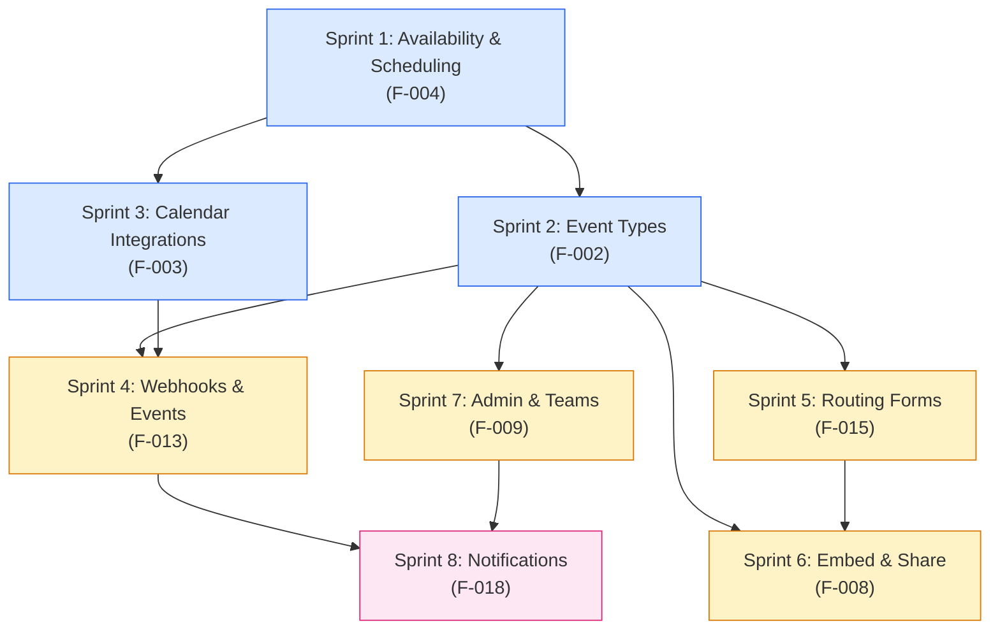
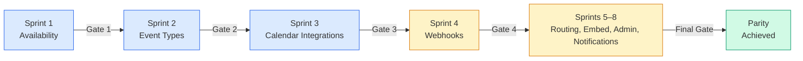

## Introduction

This sprint roadmap defines the **methodology, sequencing strategy, and execution protocol** for closing all identified capability gaps between Cal.com and Calendly's scheduling platform. It organizes work into **autonomous epic execution runs**, sequenced by inter-domain dependency ordering and business priority, to systematically bring Cal.com to full feature parity with Calendly.

The foundation for this roadmap is the [Gap Report](/gap-report/overview), which provides a systematic comparison across **8 feature domains** — availability rules, event types, calendar integrations, webhooks, routing forms, embed and share flows, admin and team governance, and notifications. Every gap identified in those domain analyses is formalized as an epic in the accompanying catalog, with acceptance criteria defined in the validation document.

<Info>
  **Behavioral Source of Truth:** All gap definitions and parity targets reference Calendly's API documentation at [developer.calendly.com](https://developer.calendly.com) as the authoritative benchmark for expected scheduling platform behavior. Where the Calendly API does not expose a capability programmatically, the Calendly Help Center is used as a supplementary behavioral reference.
</Info>

### Companion Documents

This overview is the entry point to the sprint roadmap documentation suite. It should be read in conjunction with:

- **[Epic Catalog](/sprint-roadmap/epic-catalog)** — Complete registry of all identified epics with stable IDs, priority, complexity estimates, and dependency graphs
- **[Validation Criteria](/sprint-roadmap/validation-criteria)** — Behavioral acceptance criteria, regression test requirements, and integration verification checklists for each feature domain
- **[Zero-Downtime Migration Strategy](/migration/zero-downtime-strategy)** — Approved migration patterns and rollback procedures for all schema changes during gap closure

---

## Sequencing Approach

The sprint roadmap uses a **dependency-first sequencing strategy**. Feature domains are ordered so that foundational capabilities — those depended upon by multiple downstream domains — are implemented first. This ensures that each sprint builds on verified, stable infrastructure rather than working against incomplete dependencies.

The 8 feature domains are sequenced in the following priority order. Each domain's position is justified by its dependency relationships with other domains.

### Sprint 1: Availability & Scheduling (F-004)

**Priority: Foundational — all other scheduling features depend on this domain.**

Availability rules are the bedrock of any scheduling platform. Slot generation, buffer time enforcement, minimum notice periods, DST normalization, and busy time aggregation must all function correctly before event types, calendar integrations, or bookings can operate reliably. Every downstream domain — from event types to notifications — ultimately depends on the availability engine producing correct bookable slots.

`Source: packages/features/availability/, packages/features/schedules/`

**Gap Report:** [Availability & Scheduling](/gap-report/availability-scheduling)

### Sprint 2: Event Types (F-002)

**Depends on: Availability & Scheduling (Sprint 1)**

Event type configuration references scheduling rules, buffer times, and booking windows defined by the availability engine. Cal.com's six scheduling paradigms — one-on-one, group, collective, round-robin, managed, and dynamic — all rely on correct slot generation and availability resolution before they can present bookable slots to invitees.

`Source: packages/features/eventtypes/`

**Gap Report:** [Event Types](/gap-report/event-types)

### Sprint 3: Calendar Integrations (F-003)

**Depends on: Availability & Scheduling (Sprint 1)**

Bi-directional calendar sync uses slot availability and busy time aggregation to detect conflicts across connected calendars. Cal.com's 11+ calendar adapters (Google, Outlook, Apple, CalDAV, Exchange, Lark, Feishu, Zoho, ICS Feed) must correctly read availability data to perform conflict detection and correctly write events to destination calendars.

`Source: packages/app-store/googlecalendar/, packages/app-store/office365calendar/, packages/app-store/applecalendar/`

**Gap Report:** [Calendar Integrations](/gap-report/calendar-integrations)

### Sprint 4: Webhooks & Events (F-013)

**Depends on: Event Types (Sprint 2), Calendar Integrations (Sprint 3)**

Webhook trigger events fire from the booking lifecycle — which itself depends on event types and calendar integrations functioning correctly. Cal.com's 20 `WebhookTriggerEvents` (vs. Calendly's 3 events) must produce accurate payloads that reflect the booking state established by the upstream domains. The `PayloadBuilderFactory` versioned builder architecture must be validated end-to-end.

`Source: packages/features/webhooks/`

**Gap Report:** [Webhooks & Events](/gap-report/webhooks-events)

### Sprint 5: Routing Forms (F-015)

**Depends on: Event Types (Sprint 2)**

Routing logic directs invitees to specific event type pages based on form responses. The RAQB (React Awesome Query Builder) rule engine evaluates conditional routing rules that reference event type configurations. Routing forms cannot be fully validated until event types are confirmed working with correct availability and booking flows.

`Source: packages/features/routing-forms/, packages/app-store/routing-forms/`

**Gap Report:** [Routing Forms](/gap-report/routing-forms)

### Sprint 6: Embed & Share (F-008)

**Depends on: Event Types (Sprint 2), Routing Forms (Sprint 5)**

Embed flows present booking pages to external websites using Cal.com's 3-package embed suite (`embed-core`, `embed-react`, `embed-snippet`). Inline, modal, and floating button embed modes all render event type booking pages — and may incorporate routing form navigation — so both upstream domains must be stable before embed behavior can be fully validated.

`Source: packages/embeds/`

**Gap Report:** [Embed & Share](/gap-report/embed-share)

### Sprint 7: Admin & Teams (F-009)

**Depends on: Event Types (Sprint 2)**

Admin governance and team management features — including managed event types, team routing, hierarchical organizations, sub-teams, and role-based access — all operate on event type infrastructure. Managed event types are created by organization admins and propagated to team members, requiring the event type system to be fully functional.

`Source: packages/features/ee/organizations/, packages/features/ee/teams/`

**Gap Report:** [Admin & Teams](/gap-report/admin-teams)

### Sprint 8: Notifications (F-018)

**Depends on: Webhooks & Events (Sprint 4), Admin & Teams (Sprint 7)**

Email and SMS notifications are triggered by booking lifecycle events and respect team/organization governance rules. The multi-channel notification system — spanning `packages/emails/` (SMTP, SendGrid, Resend), `packages/sms/` (Twilio SMS/WhatsApp), and `packages/features/ee/workflows/` (automated workflows) — fires after webhooks and booking confirmations, making it the final domain in the dependency chain.

`Source: packages/emails/, packages/sms/`

**Gap Report:** [Notifications](/gap-report/notifications)

---

## Sprint Dependency Flow

The following diagram illustrates the dependency relationships between the 8 feature domains. Arrows flow from a dependency to the domain that depends on it — a domain cannot begin until all domains it depends on have passed their validation gate.



**Reading the diagram:**
- **Blue nodes** (Sprints 1–3) represent foundational domains that other features depend on
- **Amber nodes** (Sprints 4–7) represent mid-tier domains with upstream dependencies
- **Pink node** (Sprint 8) represents the terminal domain that depends on multiple upstream completions

### Sprint Progression with Validation Gates

Each sprint must pass a validation gate before the next sprint begins. The following diagram shows the linear progression with gates.



<Note>
  Sprints 5 through 8 (Routing Forms, Embed & Share, Admin & Teams, Notifications) can execute in parallel where their dependencies are satisfied, but each still requires its own validation gate before the final parity declaration.
</Note>

---

## Autonomous Execution Protocol

Each sprint operates as an **autonomous execution run** — a self-contained cycle that takes a feature domain from gap analysis through implementation to validated parity. The protocol ensures consistent execution quality across all sprints.

<Steps>
  <Step title="Gap Analysis Review">
    Read the domain-specific gap report to understand all identified gaps, their severity, and the current Cal.com implementation state. Each gap report page provides the Cal.com source code analysis, the Calendly behavioral specification, and the delta between them.

    **Example:** For Sprint 1, read [Availability & Scheduling Gap Analysis](/gap-report/availability-scheduling).
  </Step>
  <Step title="Epic Selection">
    Select the epics from the [Epic Catalog](/sprint-roadmap/epic-catalog) that belong to this sprint's feature domain. Epics are pre-prioritized (Critical → High → Medium → Low) and include dependency chains that determine implementation order within the sprint.
  </Step>
  <Step title="Spec-First Design">
    Create a design spec before implementing any gap closure changes. Follow the spec-first development workflow established in the repository:

    ```bash
    cp -r specs/_templates specs/{feature-name}
    ```

    The spec folder includes:
    - `design.md` — Source of truth for what to build and how
    - `implementation.md` — Progress tracking for session continuity
    - `decisions.md` — Architecture Decision Records (ADRs) for trade-off documentation
    - `docs/` — Internal documentation with screenshots

    `Source: specs/README.md`
  </Step>
  <Step title="Implementation">
    Execute implementation following the design spec. Each implementation must adhere to existing Cal.com architectural patterns, use the established dependency injection containers, and follow the repository's code quality standards (max 5–7 files changed per PR, max 500 lines changed, one focused change per PR).

    `Source: specs/README.md`
  </Step>
  <Step title="Migration Safety">
    Apply zero-downtime migration patterns for any schema changes. All database migrations must be backward-compatible, use additive-only column changes, and include rollback procedures. Cal.com's Prisma migration infrastructure in `packages/prisma/` provides the tooling and conventions for safe schema evolution.

    See the [Zero-Downtime Migration Strategy](/migration/zero-downtime-strategy) for approved patterns.
  </Step>
  <Step title="Validation">
    Verify the implementation against the behavioral acceptance criteria defined in the [Validation Criteria](/sprint-roadmap/validation-criteria) document. Each criterion maps to a specific Calendly behavior that must be replicated in Cal.com. All five validation dimensions (behavioral testing, regression testing, data preservation, webhook compatibility, cross-domain integration) must pass.
  </Step>
  <Step title="Documentation Update">
    Update the corresponding gap report page to reflect the new parity status for completed gaps. Mark closed epics in the [Epic Catalog](/sprint-roadmap/epic-catalog) and record the validation evidence per the format defined in the [Validation Criteria](/sprint-roadmap/validation-criteria).
  </Step>
</Steps>

<Note>
  Each sprint run should follow the **spec-first development workflow**. Create a design spec before implementing any gap closure changes. This ensures architectural decisions are documented, progress is trackable across sessions, and implementation stays aligned with the gap analysis findings.
</Note>

<Warning>
  All schema migrations during gap closure **MUST** use zero-downtime patterns. Cal.com serves real-time scheduling traffic around the clock — any downtime means missed bookings and broken integrations. See the [Zero-Downtime Migration Strategy](/migration/zero-downtime-strategy) for approved migration strategies.
</Warning>

---

## Validation Gates Between Sprints

Every sprint must pass a **validation gate** before dependent sprints can begin. Gates ensure that foundational capabilities are verified before downstream domains build on them, preventing cascading failures from undetected issues.

### Gate Components

Each validation gate verifies five dimensions:

1. **Behavioral Validation** — Verify Calendly-equivalent behavior using the acceptance criteria defined in the [Validation Criteria](/sprint-roadmap/validation-criteria) document. Each criterion maps to a documented Calendly behavior that must produce the expected outcome in Cal.com.

2. **Regression Testing** — Run all existing test suites for the affected domain packages to ensure no existing Cal.com functionality is broken. A single test failure blocks the gate.

3. **Data Preservation** — Verify all existing user data (bookings, event types, availability schedules, webhook subscriptions, calendar credentials) is intact after any schema migrations applied during the sprint. See [Data Preservation](/migration/data-preservation) for procedures.

4. **Webhook Compatibility** — Confirm that existing webhook consumers still receive correct, unchanged payloads for all `v2021-10-20` webhook subscriptions. No field removals, type changes, or renames are permitted in existing payload versions. See [Webhook Backward Compatibility](/migration/webhook-compatibility) for the versioned payload strategy.

5. **Integration Testing** — Execute cross-domain tests for features that interact across boundaries. For example: verify that a booking created through a new event type triggers the correct webhook event, which fires the expected notification, using the correct availability schedule from the connected calendar.

### Gate Pass Criteria

A validation gate is passed when **all** of the following are true:

- All domain-specific behavioral acceptance criteria met
- Zero regression test failures across all affected packages
- Zero data loss — all existing user records intact and accessible
- All existing webhook consumer integrations continue receiving correct payloads
- Cross-domain integration scenarios produce expected end-to-end results

### Gate Schedule

| Gate | Between Sprints | Key Validation Focus | Dependencies |
|------|----------------|---------------------|--------------|
| **Gate 1** | Sprint 1 → Sprint 2 | Availability rules pass all acceptance criteria; slot generation produces correct results; DST handling verified | None |
| **Gate 2** | Sprint 2 → Sprint 3 | Event types configured correctly with availability rules; all 6 scheduling paradigms produce valid booking flows | Gate 1 |
| **Gate 3** | Sprint 3 → Sprint 4 | Calendar sync reads correct availability; bi-directional event creation verified for Google, Outlook, and Apple adapters | Gate 1 |
| **Gate 4** | Sprint 4 → Sprints 5–8 | Webhooks fire for all booking lifecycle events with correct payloads; existing consumers unaffected | Gates 2, 3 |
| **Gate 5** | Sprints 5–8 → Complete | All 8 domains validated; full end-to-end booking → webhook → notification flow verified across all event types | All gates |

<Warning>
  **Gate 4 is the critical convergence point.** It requires both event type validation (Gate 2) and calendar integration validation (Gate 3) to be complete. No webhook work should begin until both upstream gates pass, as webhook payloads reflect the booking state produced by event types and calendar integrations.
</Warning>

---

## Risk Management

The following risks have been identified for the gap closure initiative, along with their severity assessments and mitigation strategies. Each risk references the relevant documentation for detailed mitigation procedures.

| Risk | Severity | Mitigation | Reference |
|------|----------|-----------|-----------|
| **Schema migrations cause downtime** — New columns, indexes, or table changes could lock tables or require application restarts during deployment | **Critical** | Use zero-downtime migration patterns: additive-only columns with defaults, concurrent index creation, multi-phase column rename/type changes, shadow table strategy for large data transformations | [Zero-Downtime Migration Strategy](/migration/zero-downtime-strategy) |
| **Webhook payload changes break consumers** — Existing webhook subscribers rely on specific payload shapes; changes could break their integrations | **High** | Additive-only payload extensions within existing versions; never remove or rename fields in `v2021-10-20` payloads; use `PayloadBuilderFactory` versioning to introduce breaking changes in new versions only | [Webhook Backward Compatibility](/migration/webhook-compatibility) |
| **Existing user data loss during migration** — Bookings, event types, availability schedules, calendar credentials, and webhook subscriptions could be corrupted or deleted during schema changes | **Critical** | Pre-migration backups, row count validation, foreign key integrity checks, encrypted credential decryptability verification, orphan record detection. All migrations include explicit rollback SQL | [Data Preservation](/migration/data-preservation) |
| **Cross-domain regression** — Changes in one domain (e.g., availability) break a downstream domain (e.g., event types) in unexpected ways | **High** | Integration tests at every validation gate; cross-domain test scenarios that exercise end-to-end flows; regression test suite execution for all affected packages before gate clearance | [Validation Criteria](/sprint-roadmap/validation-criteria) |
| **Dependency ordering violation** — A sprint begins before its upstream dependencies have passed their validation gate | **Medium** | Strict gate enforcement — no sprint work proceeds until all dependency gates are cleared; the sprint dependency DAG (above) is the authoritative sequencing reference | This document |
| **Spec drift during implementation** — Implementation diverges from the design spec, creating undocumented behavior | **Medium** | Spec-first workflow with mandatory design review before coding; `implementation.md` progress tracking for session continuity; `decisions.md` ADR logging for all trade-offs | `Source: specs/README.md` |

<Note>
  Risk severity uses the same 4-level scale as gap severity: **Critical** (could halt the initiative), **High** (significant impact requiring active mitigation), **Medium** (manageable with standard practices), **Low** (minimal impact).
</Note>

---

## Quick Links

<CardGroup cols={2}>
  <Card title="Epic Catalog" icon="list-check" href="/sprint-roadmap/epic-catalog">
    Complete registry of all identified epics with stable IDs, priorities, complexity estimates, and dependency chains.
  </Card>
  <Card title="Validation Criteria" icon="clipboard-check" href="/sprint-roadmap/validation-criteria">
    Behavioral acceptance criteria, regression test requirements, and integration verification checklists for every feature domain.
  </Card>
  <Card title="Gap Report Overview" icon="chart-bar" href="/gap-report/overview">
    Executive summary of Cal.com's Calendly parity status across all 8 feature domains, with links to each domain-specific analysis.
  </Card>
  <Card title="Zero-Downtime Strategy" icon="server" href="/migration/zero-downtime-strategy">
    Approved migration patterns, rollback procedures, and deployment strategies for all schema changes during gap closure.
  </Card>
  <Card title="Data Preservation" icon="shield-halved" href="/migration/data-preservation">
    Guarantees and verification procedures for protecting existing user data through all gap closure migrations.
  </Card>
  <Card title="Webhook Compatibility" icon="webhook" href="/migration/webhook-compatibility">
    Versioned payload strategy and consumer migration guidance for maintaining backward-compatible webhook integrations.
  </Card>
</CardGroup>
