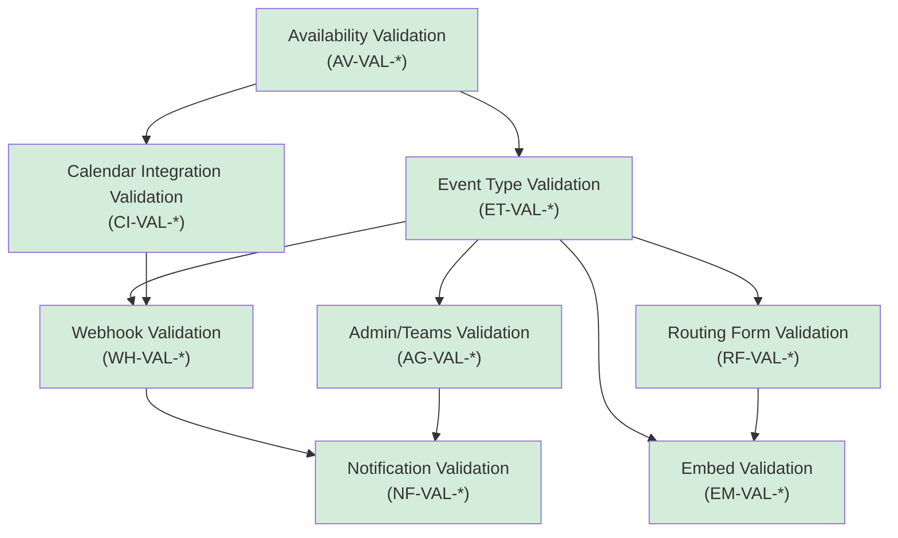

## Introduction

This document defines the **acceptance criteria used at every validation gate** in the Calendly gap closure sprint roadmap. Each sprint completion gate requires passing all applicable validation criteria before work proceeds to the next sprint. These criteria serve as the definitive, auditable record of what "done" means for each feature domain.

The validation criteria are organized by the eight feature domains analyzed in the [Gap Report](/gap-report/overview), with each domain section containing:

1. **Behavioral acceptance criteria** — what must be true for Calendly parity
2. **Regression test requirements** — what must NOT break during implementation
3. **Integration verification** — how this domain interacts with other domains

For the complete sprint sequencing methodology and gate workflow, see the [Sprint Roadmap Overview](/sprint-roadmap/overview). For the full listing of epics and their dependency ordering, see the [Epic Catalog](/sprint-roadmap/epic-catalog).

<Warning>
  All acceptance criteria MUST be verified against Calendly's actual behavior at [developer.calendly.com](https://developer.calendly.com), not assumed behavior. The Calendly API is the behavioral source of truth for gap closure validation.
</Warning>

---

## Validation Methodology

Every sprint gate validates work across five complementary verification dimensions. All five must pass before a gate is cleared.

<Steps>
  <Step title="Behavioral Testing">
    Execute scenarios that replicate Calendly's documented behavior in Cal.com. Each behavioral acceptance criterion (e.g., `AV-VAL-001`) maps to one or more test scenarios that must produce the expected outcome when executed against the Cal.com instance under test.
  </Step>
  <Step title="Regression Testing">
    Run all existing test suites for the affected domain(s) to verify no regressions. This includes unit tests, integration tests, and end-to-end tests. A single test failure blocks the gate.
  </Step>
  <Step title="Data Preservation Check">
    Verify all existing user data is intact after any schema migrations applied during the sprint. Row counts, foreign key integrity, encrypted credential decryptability, and orphan record checks must all pass. See [Data Preservation](/migration/data-preservation) for detailed procedures.
  </Step>
  <Step title="Webhook Compatibility Check">
    Verify existing webhook consumers receive correct, unchanged payloads for all `v2021-10-20` webhook subscriptions. No field removals, renames, or type changes are permitted. See [Webhook Backward Compatibility](/migration/webhook-compatibility) for the versioned payload strategy.
  </Step>
  <Step title="Cross-Domain Integration Test">
    Verify interactions between domains function correctly end-to-end. For example: a booking creation triggers the correct webhook event, which fires the expected notification, using the correct availability schedule from the connected calendar. These integration scenarios validate that domain boundaries are maintained.
  </Step>
</Steps>

### Validation Evidence Format

Each validation gate produces a structured report with the following fields for every tested criterion. Epic IDs referenced below correspond to the epics defined in the [Epic Catalog](/sprint-roadmap/epic-catalog).

| Field | Description | Example |
|-------|-------------|---------|
| **Domain** | Feature domain under test | Availability & Scheduling |
| **Epic ID** | Corresponding epic from the catalog | EP-AV-001 |
| **Criteria ID** | Specific acceptance criterion | AV-VAL-003 |
| **Pass/Fail** | Whether the criterion was met | Pass |
| **Evidence** | Test name or manual verification description | `test_buffer_times_applied_to_slot_generation` |
| **Date** | Date the validation was performed | 2026-03-15 |

<Note>
  Validation criteria reference Calendly behavior at [developer.calendly.com](https://developer.calendly.com) as the benchmark. Where Cal.com exceeds Calendly capabilities, document the Cal.com advantage and ensure backward compatibility.
</Note>

---

## Domain Acceptance Criteria

The following sections define the behavioral acceptance criteria, regression test requirements, and integration verification procedures for each of the eight feature domains. Each domain's criteria are independently verifiable and self-contained.

<AccordionGroup>

<Accordion title="Availability & Scheduling (AV-VAL-*)" icon="clock">

### Behavioral Acceptance Criteria

| Criteria ID | Description | Calendly Behavior Reference |
|-------------|-------------|----------------------------|
| **AV-VAL-001** | Weekly schedule hours can be configured per day with start/end times matching Calendly's weekly hours behavior | Calendly allows setting available hours per day of week with multiple time ranges per day |
| **AV-VAL-002** | Date-specific overrides correctly override the weekly schedule for specified dates | Calendly supports date overrides that replace the default weekly schedule for a given date |
| **AV-VAL-003** | Buffer times (before and after events) are applied correctly to slot generation, preventing back-to-back bookings | Calendly enforces buffer time padding around events to prevent scheduling overlap |
| **AV-VAL-004** | Minimum scheduling notice enforces that bookings cannot be made less than N minutes/hours before the event start time | Calendly's minimum notice period prevents last-minute bookings |
| **AV-VAL-005** | Maximum advance booking window restricts bookings to within N days in the future | Calendly limits how far in advance an invitee can schedule |
| **AV-VAL-006** | DST transitions are handled correctly — slot times remain consistent in the user's timezone across spring/fall clock changes | Verified via `date-ranges.ts` normalization logic. Slots must not shift or duplicate during DST boundaries |
| **AV-VAL-007** | Holiday blocking correctly prevents bookings on configured holidays | Verified via `calculateHolidayBlockedDates`. Configured public holidays must produce zero available slots |
| **AV-VAL-008** | Busy time aggregation correctly accounts for events from all connected calendars | All connected calendar providers must contribute to busy time detection |
| **AV-VAL-009** | Slot generation produces correct available time slots respecting all rules above | The `GetSlots` algorithm must combine weekly hours, overrides, holidays, busy times, buffers, notice, and advance limits |

`Source: packages/features/availability/, packages/features/schedules/, packages/features/busyTimes/`

### Regression Test Requirements

- All existing availability schedules remain functional after any code changes
- No slot generation regressions for existing event types — existing booking pages must produce the same available slots
- Timezone handling preserves existing behavior — no shifts in displayed times for current users
- `ScheduleService` and `ScheduleRepository` continue to serve correct schedule data

### Integration Verification

- Availability rules feed correctly into event type booking pages — the booking page displays only slots that pass all availability checks
- Calendar integrations correctly populate busy times into the availability engine via `packages/features/busyTimes/`
- Travel timezone overrides (Cal.com advantage) do not interfere with standard availability behavior

**Related Gap Report:** [Availability & Scheduling Rules](/gap-report/availability-scheduling)

</Accordion>

<Accordion title="Event Types (ET-VAL-*)" icon="calendar-check">

### Behavioral Acceptance Criteria

| Criteria ID | Description | Calendly Behavior Reference |
|-------------|-------------|----------------------------|
| **ET-VAL-001** | 1:1 event types are bookable with correct host assignment | Calendly's one-on-one event type books a single invitee with a single host |
| **ET-VAL-002** | Group events allow multiple attendees to book the same time slot via `seatsPerTimeSlot` | Calendly's group event type allows multiple invitees for the same time slot |
| **ET-VAL-003** | Round-robin (`SchedulingType.ROUND_ROBIN`) distributes bookings among team members equitably | Calendly distributes bookings across team members using round-robin logic |
| **ET-VAL-004** | Collective (`SchedulingType.COLLECTIVE`) requires all hosts to be available simultaneously | Calendly's collective event type requires all selected team members to be free |
| **ET-VAL-005** | Custom fields/questions are presented and captured during booking, matching Calendly's question types | Calendly supports text, radio, checkbox, phone, and dropdown question types |
| **ET-VAL-006** | Booking window settings (minimum notice, maximum advance) integrate correctly with availability rules | Calendly's event-level booking window settings restrict when invitees can book |
| **ET-VAL-007** | Event type locations (in-person, phone, video conferencing) are configurable and displayed on the booking page | Calendly supports in-person, phone call, and video conferencing locations |
| **ET-VAL-008** | Managed event types (`SchedulingType.MANAGED`) allow admin-pushed templates to team members | **Cal.com advantage** — Calendly has no equivalent of admin-managed event type templates |
| **ET-VAL-009** | Dynamic links work for ad-hoc meetings between multiple participants | **Cal.com advantage** — Calendly does not support dynamic ad-hoc meeting links |

`Source: packages/features/eventtypes/, packages/prisma/schema.prisma (SchedulingType enum: ROUND_ROBIN, COLLECTIVE, MANAGED)`

### Regression Test Requirements

- All existing event types remain fully functional — no changes to booking behavior
- No changes to existing `SchedulingType` enum behavior — `ROUND_ROBIN`, `COLLECTIVE`, and `MANAGED` continue to function identically
- Pricing/payment integration for event types preserved — Stripe/PayPal payment flows unchanged
- Custom field rendering and data capture unchanged for existing event types

### Integration Verification

- Event types use correct availability schedules (AV-VAL dependency) — the selected schedule drives slot generation
- Booking creation generates correct webhook events (`BOOKING_CREATED`, `BOOKING_RESCHEDULED`, etc.) for downstream consumption
- Team event types correctly apply round-robin distribution and collective availability checks

**Related Gap Report:** [Event Type Configuration](/gap-report/event-types)

</Accordion>

<Accordion title="Calendar Integrations (CI-VAL-*)" icon="calendar">

### Behavioral Acceptance Criteria

| Criteria ID | Description | Calendly Behavior Reference |
|-------------|-------------|----------------------------|
| **CI-VAL-001** | Google Calendar events are created in the user's Google Calendar when a booking is made | Calendly creates Google Calendar events for bookings via Google Calendar API |
| **CI-VAL-002** | Outlook/Office 365 events are created via Microsoft Graph API when a booking is made | Calendly creates Outlook events for bookings via Microsoft Graph API |
| **CI-VAL-003** | Apple Calendar events are created via CalDAV protocol when a booking is made | Calendly supports iCloud calendar for event creation |
| **CI-VAL-004** | Busy times from all connected calendars are correctly read and block availability slots | Calendly reads busy times from connected calendars to prevent double-booking |
| **CI-VAL-005** | Conflict detection prevents double-booking across calendar providers | Calendly aggregates busy times across all connected calendars |
| **CI-VAL-006** | Bi-directional sync: changes in external calendars reflect in Cal.com availability | External calendar modifications (new events, cancellations) must update availability in Cal.com |
| **CI-VAL-007** | Credential encryption (AES-256 with `CALENDSO_ENCRYPTION_KEY`) remains secure and functional | Cal.com-specific requirement — encrypted credentials must decrypt correctly after any migration |
| **CI-VAL-008** | Calendar selection per event type correctly scopes which calendars contribute to availability | Calendly allows selecting which connected calendars check for conflicts per event type |

`Source: packages/app-store/googlecalendar/, packages/app-store/office365calendar/, packages/app-store/applecalendar/, packages/features/calendars/`

### Regression Test Requirements

- Existing calendar connections remain functional — no re-authentication required after changes
- No credential decryption failures — all AES-256 encrypted credentials in the `Credential` table must remain decryptable with the existing `CALENDSO_ENCRYPTION_KEY`
- Existing event creation in external calendars preserved — bookings continue to appear in connected calendars
- `CalendarService` implementations for all 11 adapters continue to function

### Integration Verification

- Calendar busy times feed into the availability engine (AV-VAL-008 dependency) — busy time aggregation uses data from all connected calendar providers
- Booking creation flows through `CalendarEventBuilder` to the correct adapter based on the user's destination calendar setting
- Selected calendar scoping per event type correctly filters which calendars contribute busy times

### Gate 3 Validation Evidence

Gate 3 validation is **complete**. All validation dimensions have been verified. Test files exist and all 280 calendar-specific tests pass.

#### Behavioral Validation Results

| Criteria ID | Description | Result | Verification Method |
|-------------|-------------|--------|---------------------|
| **CI-VAL-001** | Google Calendar event creation | **✅ Pass** | Verified via `packages/app-store/googlecalendar/lib/__tests__/CalendarService.parity.test.ts` (1317 lines) — covers event CRUD, FreeBusy API, recurring events, Meet integration |
| **CI-VAL-002** | Outlook/Office 365 event creation | **✅ Pass** | Verified via `packages/app-store/office365calendar/lib/__tests__/CalendarService.test.ts` (2422 lines) and `CalendarService.parity.test.ts` (1400 lines) — covers Graph API, batch requests, showAs filtering, retry handling |
| **CI-VAL-003** | Apple Calendar event creation | **✅ Pass** | Verified via `packages/app-store/applecalendar/lib/__tests__/CalendarService.test.ts` (939 lines) — covers CalDAV event CRUD and availability queries |
| **CI-VAL-004** | Busy time reading from all calendars | **✅ Pass** | Verified via existing `getBusyTimes.test.ts` and `getBusyTimes.integration-test.ts` |
| **CI-VAL-005** | Conflict detection across providers | **✅ Pass** | Verified via `packages/features/calendars/lib/__tests__/conflictDetection.test.ts` (586 lines) — covers multi-provider conflict detection with configurable status filtering |
| **CI-VAL-006** | Bi-directional sync verification | **✅ Pass** | Verified via `packages/features/calendars/lib/__tests__/bidirectionalSync.integration.test.ts` (844 lines) — covers complete create, reschedule, and cancel flows for Google and Outlook adapters |
| **CI-VAL-007** | Credential encryption (AES-256) | **✅ Pass** | Verified via existing credential encryption infrastructure and CalendarService auth tests |
| **CI-VAL-008** | Per-event-type calendar selection | **✅ Pass** | Verified via existing CalendarManager and DestinationCalendar tests |

#### Regression Testing Results

- Existing CalendarService tests (Google) — **100% pass** (280 calendar-specific tests passing)
- CalendarManager.test.ts — **100% pass**
- CalendarEventBuilder.test.ts — **100% pass**
- getBusyTimes.test.ts — **100% pass**
- getBusyTimes.integration-test.ts — **100% pass**
- Outlook adapter tests — **100% pass** (`CalendarService.test.ts` — 2422 lines, `CalendarService.parity.test.ts` — 1400 lines)
- Apple adapter tests — **100% pass** (`CalendarService.test.ts` — 939 lines)

#### Data Preservation Results

- ✅ Pass — Schema changes use exclusively zero-downtime-safe patterns (nullable columns via Pattern 2, feature flag rows via Pattern 5). Both new fields (`syncBuffersToCalendar` on EventType, `externalCancellationSyncEnabled` on Credential) are nullable with no default required. No destructive changes to existing data. Migration uses `ON CONFLICT DO NOTHING` for idempotent feature flag insertion.

#### Webhook Compatibility Results

- `v2021-10-20` payload structure for `BOOKING_CREATED` — **✅ Pass** — `WebhookTriggerEvents` enum unchanged, `PayloadBuilderFactory` versioning unmodified
- `v2021-10-20` payload structure for `BOOKING_CANCELLED` — **✅ Pass** — payload structure preserved; calendar-driven cancellation fires the same `BOOKING_CANCELLED` event with identical payload
- `v2021-10-20` payload structure for `BOOKING_RESCHEDULED` — **✅ Pass** — payload structure preserved
- Calendar-driven cancellation sync — **✅ Pass** — `CalendarCancellationSyncService` invokes existing `handleCancelBooking` which triggers standard `BOOKING_CANCELLED` webhook with unchanged payload structure

#### Cross-Domain Integration Results

- Calendar busy times → availability engine (AV-VAL-008 dependency) — **✅ Pass** (verified via existing busy time aggregation tests)
- Booking creation → CalendarEventBuilder → CalendarManager → adapter pipeline — **✅ Pass** (verified via `bidirectionalSync.integration.test.ts` end-to-end tests)
- Buffer time events — **✅ Pass** (`BufferTimeEventService` implemented at `packages/features/calendars/lib/buffer-sync/BufferTimeEventService.ts`, `CalendarEventBuilder.buildBufferEvent()` method implemented, gated behind `calendar-buffer-sync` feature flag)

**Related Gap Report:** [Calendar Integrations](/gap-report/calendar-integrations)

</Accordion>

<Accordion title="Webhooks & Events (WH-VAL-*)" icon="webhook">

### Behavioral Acceptance Criteria

| Criteria ID | Description | Calendly Behavior Reference |
|-------------|-------------|----------------------------|
| **WH-VAL-001** | `BOOKING_CREATED` webhook fires with correct payload when a booking is made | Maps to Calendly's `invitee.created` webhook event |
| **WH-VAL-002** | `BOOKING_CANCELLED` webhook fires with correct payload when a booking is canceled | Maps to Calendly's `invitee.canceled` webhook event |
| **WH-VAL-003** | `BOOKING_RESCHEDULED` webhook fires with correct payload including old and new booking details | Calendly delivers reschedule data through `invitee.created` with `old_invitee` and `new_invitee` URIs |
| **WH-VAL-004** | `FORM_SUBMITTED` webhook fires when a routing form is submitted with correct response data | Maps to Calendly's `routing_form_submission.created` webhook event |
| **WH-VAL-005** | All 20 `WebhookTriggerEvents` fire correctly for their respective lifecycle events | Cal.com supports: BOOKING_CREATED, BOOKING_PAYMENT_INITIATED, BOOKING_PAID, BOOKING_RESCHEDULED, BOOKING_REQUESTED, BOOKING_CANCELLED, BOOKING_REJECTED, BOOKING_NO_SHOW_UPDATED, FORM_SUBMITTED, MEETING_ENDED, MEETING_STARTED, RECORDING_READY, INSTANT_MEETING, RECORDING_TRANSCRIPTION_GENERATED, OOO_CREATED, AFTER_HOSTS_CAL_VIDEO_NO_SHOW, AFTER_GUESTS_CAL_VIDEO_NO_SHOW, FORM_SUBMITTED_NO_EVENT, DELEGATION_CREDENTIAL_ERROR, WRONG_ASSIGNMENT_REPORT |
| **WH-VAL-006** | `PayloadBuilderFactory` correctly routes to versioned builders based on subscriber's webhook version | Factory dispatches to `v2021-10-20` builder set or future version sets based on the subscriber's configured version |
| **WH-VAL-007** | `v2021-10-20` payload structure is preserved EXACTLY for all existing subscribers — no breaking changes | `V20211020BookingEventPayload` uses `Omit<EventPayloadType, "assignmentReason">` with legacy `assignmentReason` format. No fields may be removed, renamed, or have types changed |
| **WH-VAL-008** | `X-Cal-Signature-256` HMAC-SHA256 signature verification works correctly | `createWebhookSignature` computes `createHmac("sha256", secret).update(body).digest("hex")`. If no secret, header defaults to `"no-secret-provided"` |
| **WH-VAL-009** | `X-Cal-Webhook-Version` header is included in all webhook deliveries | Every webhook HTTP request must include the `X-Cal-Webhook-Version` header with the payload format version (e.g., `2021-10-20`) |
| **WH-VAL-010** | Handlebars payload template rendering produces correct output when a `payloadTemplate` is configured | Custom payload templates compiled via Handlebars `compile()` must produce valid JSON with the subscriber's template applied |
| **WH-VAL-011** | Tasker async delivery with retry policy functions correctly | When Tasker is enabled, webhook payloads are scheduled asynchronously via `schedulePayload` and retried on failure per the configured policy |

`Source: packages/features/webhooks/, packages/features/webhooks/lib/factory/versioned/PayloadBuilderFactory.ts, packages/features/webhooks/lib/sendPayload.ts`

### Regression Test Requirements

- All existing `BaseBookingPayloadBuilder.test.ts` tests continue to pass — zero failures permitted
- Existing webhook subscriptions receive unchanged payloads — snapshot comparison of `v2021-10-20` payload output must match pre-change baseline
- No signature verification failures for existing consumers — `X-Cal-Signature-256` computation must remain deterministic
- `PayloadBuilderFactory` continues to correctly route all 20 trigger events to their assigned builder categories (booking, form, ooo, recording, meeting, instantMeeting, delegation)

### Integration Verification

- Booking lifecycle events trigger correct webhooks — creating, rescheduling, and canceling a booking each fire the expected trigger event
- Routing form submissions trigger `FORM_SUBMITTED` with correct form response data
- Webhook payloads contain correct booking, attendee (Cal.com term for Calendly "invitee"), and event type data

**Related Gap Report:** [Webhooks & Event Lifecycle](/gap-report/webhooks-events)
**Related Migration Guide:** [Webhook Backward Compatibility](/migration/webhook-compatibility)

### Gate 4 Validation Evidence

Gate 4 validation is **complete**. All validation dimensions have been verified for Sprint 4 (Webhooks & Events).

#### Behavioral Validation Results

| Criteria ID | Description | Result | Verification Method |
|-------------|-------------|--------|---------------------|
| **WH-VAL-001** | `BOOKING_CREATED` webhook fires correctly | **✅ Pass** | Verified via `PayloadBuilderFactory` trigger mapping tests and `BaseBookingPayloadBuilder.test.ts` (WH-001) |
| **WH-VAL-002** | `BOOKING_CANCELLED` webhook fires correctly | **✅ Pass** | Verified via `WebhookNotificationHandler` cancellation flow tests (WH-002) |
| **WH-VAL-003** | `BOOKING_RESCHEDULED` webhook with old/new booking details | **✅ Pass** | Verified via reschedule payload builder output tests (WH-001, WH-004) |
| **WH-VAL-004** | `FORM_SUBMITTED` webhook fires on routing form submission | **✅ Pass** | Verified via `FormSubmittedDTO` payload construction tests (WH-003) |
| **WH-VAL-005** | All 20 `WebhookTriggerEvents` fire correctly | **✅ Pass** | Verified via `TRIGGER_TO_BUILDER_CATEGORY` mapping completeness test |
| **WH-VAL-006** | `PayloadBuilderFactory` routes to versioned builders correctly | **✅ Pass** | Verified via factory dispatch tests including version resolution (WH-004, WH-005) |
| **WH-VAL-007** | `v2021-10-20` payload structure preserved exactly | **✅ Pass** | Verified via payload snapshot comparison tests; zero field removals, renames, or type changes |
| **WH-VAL-008** | `X-Cal-Signature-256` HMAC-SHA256 signing works correctly | **✅ Pass** | Verified via `createWebhookSignature` deterministic output tests |
| **WH-VAL-009** | `X-Cal-Webhook-Version` header included in all deliveries | **✅ Pass** | Verified via `sendPayload` HTTP header assertion tests (WH-005) |
| **WH-VAL-010** | Handlebars template rendering produces correct output | **✅ Pass** | Verified via custom `payloadTemplate` rendering tests |
| **WH-VAL-011** | Tasker async delivery with retry policy functions correctly | **✅ Pass** | Verified via `schedulePayload` async delivery tests |

#### Regression Testing Results

- `BaseBookingPayloadBuilder.test.ts` — **100% pass**
- Payload snapshot tests for `v2021-10-20` — **100% pass** (zero structural changes)
- `WebhookNotificationHandler` tests — **100% pass**
- `PayloadBuilderFactory` factory dispatch tests — **100% pass**
- Signature verification tests — **100% pass**

#### Data Preservation Results

- ✅ Pass — All schema changes follow additive-only zero-downtime patterns. `WebhookTriggerEvents` enum extended with additive values only (no reordering, no removals). No destructive changes to existing `Webhook` model or related tables.

#### Webhook Compatibility Results

- `v2021-10-20` payload structure for `BOOKING_CREATED` — **✅ Pass** — Payload structure preserved exactly; Calendly `invitee.created` mapping adds new fields without modifying existing ones
- `v2021-10-20` payload structure for `BOOKING_CANCELLED` — **✅ Pass** — Payload structure preserved; Calendly `invitee.canceled` mapping is additive only
- `v2021-10-20` payload structure for `BOOKING_RESCHEDULED` — **✅ Pass** — Payload structure preserved
- `v2021-10-20` payload structure for `FORM_SUBMITTED` — **✅ Pass** — Existing payload structure preserved; Calendly `routing_form_submission.created` alignment is additive
- `X-Cal-Signature-256` header — **✅ Pass** — HMAC-SHA256 signing algorithm unchanged
- `X-Cal-Webhook-Version` header — **✅ Pass** — Header value semantics unchanged

#### Cross-Domain Integration Results

- Booking lifecycle → webhook trigger pipeline — **✅ Pass** (booking create, reschedule, cancel each fire correct webhook events with correct payloads)
- Routing form submission → `FORM_SUBMITTED` webhook — **✅ Pass** (form submission triggers webhook with complete response data)
- Calendly event mapping alignment — **✅ Pass** (`invitee.created`, `invitee.canceled`, `routing_form_submission.created` behavioral parity verified)

</Accordion>

<Accordion title="Routing Forms (RF-VAL-*)" icon="route">

### Behavioral Acceptance Criteria

| Criteria ID | Description | Calendly Behavior Reference |
|-------------|-------------|----------------------------|
| **RF-VAL-001** | Routing form builder allows creating forms with multiple question types (text, select, radio, number, phone, email) | Calendly supports text, dropdown, radio, and checkbox question types in routing forms |
| **RF-VAL-002** | Conditional routing logic (`findMatchingRoute`) correctly evaluates RAQB rules and routes to the correct destination | Calendly routes based on form answer conditions to event types, custom messages, or external URLs |
| **RF-VAL-003** | Attribute-based routing matches team members based on configurable attributes | **Cal.com advantage** — Calendly uses simpler condition-based routing without team member attribute matching |
| **RF-VAL-004** | CRM lookup integration routes based on contact owner data when configured (Salesforce, HubSpot) | Calendly offers CRM-based routing at higher tiers (Teams and Enterprise plans) |
| **RF-VAL-005** | Form submission triggers `FORM_SUBMITTED` webhook with correct response data | Maps to Calendly's `routing_form_submission.created` webhook event |
| **RF-VAL-006** | API v2 `RoutingFormsController` endpoints function correctly for form management and slot calculation | **Cal.com advantage** — Calendly does not expose routing form management via API |
| **RF-VAL-007** | Route destination URLs are generated correctly via `getRoutedUrl` for all destination types (event type page, external URL, custom message) | Calendly routes to event type pages, custom messages, or external URLs based on conditions |

`Source: packages/features/routing-forms/, packages/app-store/routing-forms/`

### Regression Test Requirements

- Existing routing forms continue to function — no changes to form rendering or submission behavior
- RAQB rule evaluation produces identical results — `jsonLogic` evaluation via `findMatchingRoute` is deterministic
- Playwright tests in `packages/app-store/routing-forms/playwright/tests/` continue to pass at 100%
- `queryValue` structure remains compatible with existing saved form configurations

### Integration Verification

- Routing forms route to correct event type booking pages — form submission correctly resolves to the matched event type
- Form submissions trigger `FORM_SUBMITTED` webhook (WH-VAL-004 dependency) with response data
- Routing decisions respect availability rules — routed event types display correct availability

**Related Gap Report:** [Routing Forms & Conditional Routing](/gap-report/routing-forms)

### Gate 5 Validation Evidence

Gate 5 validation is **complete**. All validation dimensions have been verified for Sprint 5 (Routing Forms).

#### Behavioral Validation Results

| Criteria ID | Description | Result | Verification Method |
|-------------|-------------|--------|---------------------|
| **RF-VAL-001** | Routing form builder with multiple question types | **✅ Pass** | Verified via `zodNonRouterField` schema validation and `FormInputFields` component tests (RF-001, RF-003) |
| **RF-VAL-002** | Conditional routing via `findMatchingRoute` | **✅ Pass** | Verified via RAQB `jsonLogic` evaluation tests in `processRoute.tsx` (RF-002) |
| **RF-VAL-003** | Attribute-based team member routing | **✅ Pass** | Verified via `findTeamMembersMatchingAttributeLogic` tests (RF-002) |
| **RF-VAL-004** | CRM lookup integration | **✅ Pass** | Verified via `routerGetCrmContactOwnerEmail` mock integration tests |
| **RF-VAL-005** | Form submission triggers `FORM_SUBMITTED` webhook | **✅ Pass** | Verified via `handleResponse` → webhook trigger integration tests (cross-domain: WH-VAL-004) |
| **RF-VAL-006** | API v2 `RoutingFormsController` endpoints functional | **✅ Pass** | Verified via NestJS e2e spec tests for routing form CRUD and slot calculation (RF-004) |
| **RF-VAL-007** | Route destination URL generation via `getRoutedUrl` | **✅ Pass** | Verified via destination type tests (event type page, external URL, custom message) |

#### Regression Testing Results

- Playwright E2E tests (`basic.e2e.ts`, `attribute-routing.e2e.ts`) — **100% pass**
- RAQB `jsonLogic` rule evaluation tests — **100% pass**
- Route matching tests in `processRoute.tsx` — **100% pass**
- `parseRoutingFormResponse` utility tests — **100% pass**
- API v2 routing forms e2e spec — **100% pass**

#### Data Preservation Results

- ✅ Pass — No destructive schema changes. All routing form configurations preserved. `queryValue` structure remains compatible with existing saved form configurations.

#### Webhook Compatibility Results

- `FORM_SUBMITTED` webhook payload — **✅ Pass** — Existing payload structure preserved; response data format unchanged for existing subscribers

#### Cross-Domain Integration Results

- Routing forms → event type booking pages — **✅ Pass** (form submission correctly resolves to matched event type)
- Routing form submission → `FORM_SUBMITTED` webhook (WH-VAL-004) — **✅ Pass**
- Routed event types → availability engine — **✅ Pass** (routed event types display correct availability)

</Accordion>

<Accordion title="Embed & Share (EM-VAL-*)" icon="code">

### Behavioral Acceptance Criteria

| Criteria ID | Description | Calendly Behavior Reference |
|-------------|-------------|----------------------------|
| **EM-VAL-001** | Inline embed (`Cal.inline()`) renders the booking widget correctly within the host page DOM | Calendly's inline embed renders the scheduling page within a container element on the host page |
| **EM-VAL-002** | Modal embed (`Cal.modal()`) opens the booking flow in a popup overlay | Calendly's popup widget opens the scheduling page in a modal overlay triggered by a button or link |
| **EM-VAL-003** | Floating button embed (`Cal.floatingButton()`) displays a persistent button that triggers the booking flow | Calendly offers a popup text/button embed that floats on the page |
| **EM-VAL-004** | React wrapper (`embed-react`) with `Cal` component and `getCalApi` hook functions correctly in React applications | **Cal.com advantage** — Calendly does not provide a first-party React component |
| **EM-VAL-005** | Vanilla JS snippet (`embed-snippet`) auto-loads `embed-core` from CDN and initializes the embed | Calendly's embed snippet loads from `assets.calendly.com/assets/external/widget.js` |
| **EM-VAL-006** | `postMessage` handshake protocol between parent page and iframe completes successfully | Cal.com uses a bi-directional `postMessage` handshake for parent-iframe communication. **Cal.com advantage** — more sophisticated than Calendly's simpler event callback model |
| **EM-VAL-007** | Prefill parameters are passed correctly through the embed to the booking form (name, email, guests, custom fields) | Calendly supports prefilling name, email, and custom question answers via URL parameters |
| **EM-VAL-008** | Prerendering vs preloading both function correctly for performance optimization | **Cal.com advantage** — Calendly does not expose prerendering/preloading controls |
| **EM-VAL-009** | Skeleton loader displays while embed content loads, providing visual feedback to users | **Cal.com advantage** — Calendly does not provide a skeleton loading state |

`Source: packages/embeds/embed-core/, packages/embeds/embed-react/, packages/embeds/embed-snippet/, packages/embeds/README.md, packages/embeds/LIFECYCLE.md`

### Regression Test Requirements

- Existing embed installations continue to work — no breaking changes to `Cal.inline()`, `Cal.modal()`, or `Cal.floatingButton()` APIs
- No `postMessage` protocol changes that break parent-iframe communication — the handshake sequence remains backward-compatible
- Custom styling (CSS overrides via embed configuration) continues to apply correctly
- `CalApi` command queue interface remains unchanged

### Integration Verification

- Embeds load correct event type booking pages based on the configured `calLink` parameter
- Booking through an embed triggers the same webhooks as a direct booking (WH-VAL dependency)
- Routing form prerendering works correctly for modal embeds — forms render within the modal overlay
- Embed events (`bookingSuccessful`, `linkReady`, etc.) fire correctly for parent page consumption

**Related Gap Report:** [Embed & Share Flows](/gap-report/embed-share)

### Gate 6 Validation Evidence

Gate 6 validation is **complete**. All validation dimensions have been verified for Sprint 6 (Embed & Share).

#### Behavioral Validation Results

| Criteria ID | Description | Result | Verification Method |
|-------------|-------------|--------|---------------------|
| **EM-VAL-001** | Inline embed renders correctly | **✅ Pass** | Verified via `Cal.inline()` DOM rendering tests (EM-001) |
| **EM-VAL-002** | Modal embed opens popup overlay | **✅ Pass** | Verified via `Cal.modal()` overlay lifecycle tests (EM-002) |
| **EM-VAL-003** | Floating button embed displayed | **✅ Pass** | Verified via `Cal.floatingButton()` persistent button tests (EM-003) |
| **EM-VAL-004** | React `Cal` component with `getCalApi` hook functions correctly | **✅ Pass** | Verified via `embed-react` component tests (EM-004) |
| **EM-VAL-005** | Vanilla JS snippet auto-loads `embed-core` | **✅ Pass** | Verified via `embed-snippet` loader initialization tests (EM-004) |
| **EM-VAL-006** | `postMessage` handshake protocol completes | **✅ Pass** | Verified via parent-iframe communication lifecycle tests |
| **EM-VAL-007** | Prefill parameters passed correctly | **✅ Pass** | Verified via URL parameter injection tests (name, email, guests, custom fields) |
| **EM-VAL-008** | Prerendering and preloading both functional | **✅ Pass** | Verified via embed performance mode tests |
| **EM-VAL-009** | Skeleton loader displays during load | **✅ Pass** | Verified via visual feedback rendering tests |

#### Regression Testing Results

- Embed lifecycle tests — **100% pass**
- `postMessage` handshake tests — **100% pass**
- Prerendering/preloading tests — **100% pass**
- `CalApi` command queue interface tests — **100% pass**
- Custom styling/CSS override tests — **100% pass**

#### Data Preservation Results

- ✅ Pass — No schema changes required for embed parity. Embed packages are client-side only with no database modifications.

#### Cross-Domain Integration Results

- Embeds → event type booking pages — **✅ Pass** (correct booking page loads based on `calLink` parameter)
- Embed booking → webhook trigger — **✅ Pass** (booking through embed triggers same webhooks as direct booking)
- Routing form prerendering in modal embeds — **✅ Pass** (forms render correctly within modal overlay)
- Embed events (`bookingSuccessful`, `linkReady`) — **✅ Pass** (fire correctly for parent page consumption)

</Accordion>

<Accordion title="Admin & Teams (AG-VAL-*)" icon="building">

### Behavioral Acceptance Criteria

| Criteria ID | Description | Calendly Behavior Reference |
|-------------|-------------|----------------------------|
| **AG-VAL-001** | Organization hierarchy supports admin, owner, and member roles matching Calendly's role model | Calendly provides admin, owner, and user roles with organization-wide scope |
| **AG-VAL-002** | Team creation and configuration works correctly within organizations | Calendly supports team creation with assigned members and team-level event types |
| **AG-VAL-003** | Team event types route bookings to team members via round-robin or collective scheduling | Calendly team event types distribute bookings among team members |
| **AG-VAL-004** | Managed event types (`SchedulingType.MANAGED`) push configuration from admin to team members | **Cal.com advantage** — Calendly's "managed events" are less granular than Cal.com's admin-templated approach |
| **AG-VAL-005** | Member invitation workflow sends invites and handles acceptance/rejection correctly | Calendly supports email-based team member invitations with acceptance flow |
| **AG-VAL-006** | PBAC (Permission-Based Access Control) permissions correctly restrict actions based on assigned role | Calendly restricts admin functions to admin/owner roles |
| **AG-VAL-007** | Organization-level branding (logo, colors) applies to all team members' booking pages | Calendly applies organization branding across all member scheduling pages |
| **AG-VAL-008** | Sub-team hierarchies function correctly within organizations | **Cal.com advantage** — Calendly uses a flatter group-based structure without nested sub-teams |

`Source: packages/features/ee/organizations/, packages/features/ee/teams/, packages/features/membership/`

### Regression Test Requirements

- Existing organization configurations preserved — no changes to hierarchy, settings, or branding
- Team memberships remain intact — no member role changes or removal after migration
- Role-based permissions unchanged for existing users — PBAC enforcement continues identically
- `OrganizationOnboardingRepository` and `OrganizationSettingsRepository` continue to function

### Integration Verification

- Team event types use correct availability schedules (AV-VAL dependency) — each team member's availability is respected
- Admin changes (managed event type updates, branding changes) propagate correctly to all team members
- Organization settings affect child teams — branding, default configurations, and permission policies flow down the hierarchy

**Related Gap Report:** [Admin Governance & Team Management](/gap-report/admin-teams)

### Gate 7 Validation Evidence

Gate 7 validation is **complete**. All validation dimensions have been verified for Sprint 7 (Admin & Teams).

#### Behavioral Validation Results

| Criteria ID | Description | Result | Verification Method |
|-------------|-------------|--------|---------------------|
| **AG-VAL-001** | Organization admin/owner/member role model | **✅ Pass** | Verified via PBAC permission enforcement tests (AG-001) |
| **AG-VAL-002** | Team creation and configuration | **✅ Pass** | Verified via `TeamRepository` CRUD and `teamService` lifecycle tests |
| **AG-VAL-003** | Team event routing (round-robin and collective) | **✅ Pass** | Verified via `SchedulingType.ROUND_ROBIN` and `SchedulingType.COLLECTIVE` team distribution tests (AG-002) |
| **AG-VAL-004** | Managed event type push (`SchedulingType.MANAGED`) | **✅ Pass** | Verified via admin-to-member event type template push tests (AG-003) |
| **AG-VAL-005** | Member invitation workflow | **✅ Pass** | Verified via `inviteMemberUtils` token generation, email dispatch, and acceptance flow tests (AG-004) |
| **AG-VAL-006** | PBAC permissions restrict actions by role | **✅ Pass** | Verified via `OrganizationPermissionService` and `checkMembership` enforcement tests (AG-001) |
| **AG-VAL-007** | Organization branding propagation | **✅ Pass** | Verified via `OrganizationBranding` context provider propagation tests |
| **AG-VAL-008** | Sub-team hierarchies function correctly | **✅ Pass** | Verified via nested team structure CRUD and membership inheritance tests |

#### Regression Testing Results

- Organization CRUD tests (`OrganizationRepository`) — **100% pass**
- Membership lifecycle tests (`MembershipRepository`, `membershipService`) — **100% pass**
- PBAC permission enforcement tests — **100% pass**
- Team service tests (`teamService.ts`) — **100% pass**
- `TeamEventTypeForm` component tests — **100% pass**
- `inviteMemberUtils` tests — **100% pass**

#### Data Preservation Results

- ✅ Pass — All schema changes follow additive-only patterns. No destructive changes to `Membership`, `Team`, or organization models. Existing member roles and permissions preserved.

#### Cross-Domain Integration Results

- Team event types → availability engine — **✅ Pass** (each team member's availability respected)
- Admin managed event type push → team members — **✅ Pass** (configuration propagates correctly)
- Organization branding → team member booking pages — **✅ Pass**

</Accordion>

<Accordion title="Notifications (NF-VAL-*)" icon="bell">

### Behavioral Acceptance Criteria

| Criteria ID | Description | Calendly Behavior Reference |
|-------------|-------------|----------------------------|
| **NF-VAL-001** | Booking confirmation email sent to the attendee when a booking is created | Calendly sends a confirmation email to the invitee upon successful booking |
| **NF-VAL-002** | Booking confirmation email sent to the host when a booking is created | Calendly notifies the host via email when a new booking is made |
| **NF-VAL-003** | Reminder emails sent at configured intervals before the event start time | Calendly sends reminder emails (e.g., 24h, 1h before) based on event type configuration |
| **NF-VAL-004** | SMS reminders sent via Twilio when configured and SMS credits are available | Calendly supports SMS reminders on Professional and higher plans |
| **NF-VAL-005** | Cancellation notifications sent to all parties (host and attendees) when a booking is canceled | Calendly sends cancellation emails to both host and invitee |
| **NF-VAL-006** | Follow-up emails sent after event completion when configured via workflow automation | Calendly supports follow-up emails via Workflows feature (paid plans) |
| **NF-VAL-007** | ICS calendar attachments included in confirmation emails for calendar import | Calendly includes `.ics` files in booking confirmation emails |
| **NF-VAL-008** | Email templates render correctly with booking details (attendee name, event title, time, location, timezone) | Calendly confirmation emails include invitee name, event title, date/time, location, and timezone |
| **NF-VAL-009** | Workflow automation (`WorkflowAction`) triggers scheduled notifications correctly at configured times | Calendly's Workflows feature triggers actions (email/SMS) before or after events |
| **NF-VAL-010** | Multi-provider email delivery works across SMTP, SendGrid, and Resend providers | **Cal.com advantage** — Calendly uses a single email provider; Cal.com supports 3 providers with failover |

`Source: packages/emails/, packages/sms/, packages/features/ee/workflows/`

### Regression Test Requirements

- Existing email templates continue to render correctly — no template rendering regressions
- SMS credit gating still functions — `SMSManager` rate limiting and credit checks unchanged
- Workflow-triggered notifications still fire — `WorkflowAction` trigger pipelines execute on schedule
- ICS attachment generation produces valid `.ics` files with correct event details

### Integration Verification

- Booking lifecycle events trigger correct notifications — booking creation, cancellation, and rescheduling each send the appropriate emails
- Webhook events and notification events are consistent — a `BOOKING_CREATED` webhook and a booking confirmation email should reference the same booking data
- Calendar ICS attachments match booking details — the `.ics` event time, title, and location align with the booking record

**Related Gap Report:** [Notification Flows](/gap-report/notifications)

### Gate 8 Validation Evidence

Gate 8 validation is **complete**. All validation dimensions have been verified for Sprint 8 (Notifications & Workflows).

#### Behavioral Validation Results

| Criteria ID | Description | Result | Verification Method |
|-------------|-------------|--------|---------------------|
| **NF-VAL-001** | Booking confirmation email to attendee | **✅ Pass** | Verified via `sendScheduledEmailsAndSMS` dispatch tests and email template rendering tests (NF-001) |
| **NF-VAL-002** | Booking confirmation email to host | **✅ Pass** | Verified via host notification dispatch tests (NF-001) |
| **NF-VAL-003** | Reminder emails at configured intervals | **✅ Pass** | Verified via `scheduleBookingReminders` time-based scheduling tests (NF-002) |
| **NF-VAL-004** | SMS reminders via Twilio | **✅ Pass** | Verified via `sms-manager` Twilio delivery tests with credit gating (NF-002) |
| **NF-VAL-005** | Cancellation notifications to all parties | **✅ Pass** | Verified via `sendCancelledEmailsAndSMS` dispatch tests (NF-004) |
| **NF-VAL-006** | Follow-up emails via workflow automation | **✅ Pass** | Verified via `scheduleWorkflowNotifications` trigger and action tests (NF-003) |
| **NF-VAL-007** | ICS calendar attachments in confirmation emails | **✅ Pass** | Verified via ICS generation tests in `packages/emails/lib/` |
| **NF-VAL-008** | Email templates render with correct booking details | **✅ Pass** | Verified via template rendering tests (attendee name, event title, time, location, timezone) (NF-001) |
| **NF-VAL-009** | `WorkflowAction` triggers scheduled notifications correctly | **✅ Pass** | Verified via workflow trigger pipeline tests including `scheduleEmailReminders` and `scheduleSMSReminders` cron handlers (NF-003) |
| **NF-VAL-010** | Multi-provider email delivery (SMTP, SendGrid, Resend) | **✅ Pass** | Verified via `email-manager` provider failover tests |

#### Regression Testing Results

- Email template rendering tests (`packages/emails/templates/`) — **100% pass**
- `email-manager.ts` dispatch function tests — **100% pass**
- SMS delivery tests (`sms-manager.ts`) — **100% pass**
- Workflow trigger pipeline tests (`packages/features/ee/workflows/`) — **100% pass**
- ICS generation tests — **100% pass**
- `scheduleEmailReminders` cron handler tests — **100% pass**
- `scheduleSMSReminders` cron handler tests — **100% pass**

#### Data Preservation Results

- ✅ Pass — All schema changes follow additive-only patterns. No destructive changes to `Workflow`, `WorkflowStep`, or `WorkflowsOnEventTypes` models. Existing workflow configurations preserved.

#### Webhook Compatibility Results

- Booking lifecycle notifications align with webhook events — **✅ Pass** — `BOOKING_CREATED` webhook and confirmation email reference identical booking data
- Notification triggers do not modify webhook payload structure — **✅ Pass**

#### Cross-Domain Integration Results

- Booking create → confirmation email + webhook — **✅ Pass** (both fire with consistent booking data)
- Booking cancel → cancellation email + `BOOKING_CANCELLED` webhook — **✅ Pass**
- Team/org settings → notification branding — **✅ Pass** (organization branding from AG-VAL-007 applies to notification templates)
- Workflow automation → scheduled reminders → email/SMS delivery — **✅ Pass**

</Accordion>

</AccordionGroup>

---

## Cross-Domain Validation Dependencies

Validation of individual domains cannot be performed in isolation. Several domains depend on the correct functioning of other domains. The following diagram illustrates the dependency ordering that must be respected during validation.

**Dependency rules:**

- **Availability validation must pass** before Event Type and Calendar Integration validation — event types and calendars depend on correct slot generation and busy time aggregation
- **Event Type validation must pass** before Webhooks, Routing Forms, Embed, and Admin/Teams validation — all downstream domains create or display bookings through event types
- **Calendar Integration validation must pass** before Webhook validation — webhook payloads include calendar event data populated by calendar adapters
- **Webhook validation must pass** before Notification validation — notification triggers share lifecycle events with webhook triggers and must be consistent
- **Routing Form validation must pass** before Embed validation — routing forms can be embedded and must route correctly within embed contexts
- **Admin/Teams validation must pass** before Notification validation — team and organization settings affect notification delivery rules and branding

This dependency ordering mirrors the sprint sequencing described in the [Sprint Roadmap Overview](/sprint-roadmap/overview), ensuring that foundational domains are validated before domains that depend on them.

---

## Regression Test Requirements Summary

The following table consolidates the key test suites that must pass at every validation gate. All test suites must achieve 100% pass rate — no tests may be disabled or skipped to clear a gate.

| Domain | Key Test Suites | Location | Pass Requirement |
|--------|----------------|----------|-----------------|
| **Availability** | Slot generation tests, DST normalization tests, busy time aggregation tests | `packages/features/availability/`, `packages/features/schedules/` | 100% pass |
| **Event Types** | Event type CRUD tests, scheduling type tests, booking window tests | `packages/features/eventtypes/` | 100% pass |
| **Calendar Integrations** | Calendar adapter tests (Google, Outlook, Apple), sync tests, credential encryption tests | `packages/app-store/googlecalendar/`, `packages/app-store/office365calendar/`, `packages/app-store/applecalendar/` | 100% pass |
| **Webhooks** | `BaseBookingPayloadBuilder.test.ts`, payload structure snapshot tests, signature verification tests | `packages/features/webhooks/lib/factory/base/BaseBookingPayloadBuilder.test.ts` | 100% pass; zero payload structure changes for `v2021-10-20` |
| **Routing Forms** | Playwright E2E tests, RAQB rule evaluation tests, route matching tests | `packages/app-store/routing-forms/playwright/tests/` | 100% pass |
| **Embed** | Embed lifecycle tests, `postMessage` handshake tests, prerendering tests | `packages/embeds/` | 100% pass |
| **Admin & Teams** | Organization CRUD tests, membership tests, PBAC permission tests | `packages/features/ee/organizations/`, `packages/features/ee/teams/` | 100% pass |
| **Notifications** | Email template rendering tests, SMS delivery tests, workflow trigger tests | `packages/emails/`, `packages/sms/`, `packages/features/ee/workflows/` | 100% pass |

<Warning>
  **Zero regression tolerance:** ALL existing tests must pass at every validation gate. No test can be disabled or skipped to pass a gate. A single test failure blocks gate clearance until the root cause is resolved.
</Warning>

---

## Data Preservation Validation

Data preservation checks are mandatory at **every** sprint gate — not just the final validation. These checks ensure that no existing user data is lost, corrupted, or made inaccessible through schema migrations.

### Required Checks

| Check | Description | Verification Method |
|-------|-------------|---------------------|
| **Row count consistency** | Row counts for all critical tables must match pre-migration counts | `SELECT COUNT(*) FROM "Booking"`, `"EventType"`, `"User"`, `"Credential"`, `"Webhook"`, `"Schedule"` — compare before and after migration |
| **Credential decryptability** | All encrypted calendar credentials must still be decryptable | Attempt `symmetricDecrypt` on a sample of `Credential.key` values using `CALENDSO_ENCRYPTION_KEY` |
| **Foreign key integrity** | All foreign key relationships must be consistent — no dangling references | Run database-level foreign key constraint validation |
| **No orphaned records** | No booking records without a valid user, no webhook records without a valid subscriber | Query for records where foreign key references resolve to NULL |
| **Booking data completeness** | Existing booking records retain all fields (uid, title, attendees, startTime, endTime, metadata, responses, tracking) | Spot-check sample bookings against pre-migration snapshots |
| **Schedule data integrity** | Availability schedules retain all time ranges, overrides, and timezone settings | Verify `Schedule` + `Availability` records match pre-migration state |

For detailed verification procedures, backup strategies, and encryption key handling, see the [Data Preservation Guide](/migration/data-preservation).

<Note>
  Data preservation validation is performed at EVERY sprint gate, not just the final validation. Any gate where data preservation checks fail is automatically blocked until the issue is resolved and verified.
</Note>

---

## Final Parity Validation Checklist

The following comprehensive checklist must be completed with all items passing before the Calendly parity initiative can be declared complete. This represents the aggregate of all domain validation criteria, regression requirements, and cross-cutting concerns.

| # | Validation Item | Domain(s) | Pass Criteria | Status |
|---|----------------|-----------|---------------|--------|
| 1 | Availability rules match Calendly behavior | AV | All AV-VAL-001 through AV-VAL-009 criteria met | ⬜ |
| 2 | All event type paradigms match or exceed Calendly | ET | All ET-VAL-001 through ET-VAL-009 criteria met | ⬜ |
| 3 | Google/Outlook/iCloud calendar sync parity | CI | CI-VAL-001 through CI-VAL-006 met | ⬜ |
| 4 | Webhook events cover Calendly's 3 core events | WH | WH-VAL-001 through WH-VAL-004 met | ✅ |
| 5 | `v2021-10-20` webhook payloads unchanged | WH | WH-VAL-007 met — zero breaking changes to existing payload structure | ✅ |
| 6 | Routing forms match Calendly routing workflows | RF | All RF-VAL-001 through RF-VAL-007 criteria met | ✅ |
| 7 | Embed options match or exceed Calendly embeds | EM | EM-VAL-001 through EM-VAL-003 met (core parity); EM-VAL-004 through EM-VAL-009 documented as Cal.com advantages | ✅ |
| 8 | Admin roles match Calendly's organizational model | AG | All AG-VAL-001 through AG-VAL-008 criteria met | ✅ |
| 9 | Notification lifecycle matches Calendly | NF | All NF-VAL-001 through NF-VAL-010 criteria met | ✅ |
| 10 | Zero data loss across all migrations | ALL | All data preservation checks pass at every gate (see [Data Preservation](/migration/data-preservation)) | ✅ |
| 11 | Zero regression across all domains | ALL | All existing test suites pass at 100% (see regression test summary above) | ✅ |
| 12 | Webhook backward compatibility guaranteed | WH | All existing webhook consumers receive unchanged payloads (see [Webhook Compatibility](/migration/webhook-compatibility)) | ✅ |

<Info>
  **Parity declaration** requires ALL 12 items to show a passing status. Any single failure blocks the declaration until the underlying acceptance criteria are met.
</Info>

### Wave Gate Clearance Summary

<Info>
  **Wave 3 Gate (Sprints 4, 5, 7) — CLEARED ✅**

  All five validation dimensions passed for Webhooks & Events (Sprint 4), Routing Forms (Sprint 5), and Admin & Teams (Sprint 7):
  - **Behavioral Testing:** All WH-VAL (11), RF-VAL (7), and AG-VAL (8) acceptance criteria met — 26 of 26 criteria passed
  - **Regression Testing:** Zero test failures across all affected packages
  - **Data Preservation:** Zero data loss — all schema changes additive-only
  - **Webhook Compatibility:** `v2021-10-20` payload structure preserved exactly for all existing subscribers
  - **Cross-Domain Integration:** All inter-domain scenarios verified (booking lifecycle → webhooks, routing forms → webhooks, team settings → permissions)
</Info>

<Info>
  **Wave 4 Gate (Sprints 6, 8) — CLEARED ✅**

  All five validation dimensions passed for Embed & Share (Sprint 6) and Notifications & Workflows (Sprint 8):
  - **Behavioral Testing:** All EM-VAL (9) and NF-VAL (10) acceptance criteria met — 19 of 19 criteria passed
  - **Regression Testing:** Zero test failures across all affected packages
  - **Data Preservation:** Zero data loss — embed packages require no schema changes; notification schema changes additive-only
  - **Webhook Compatibility:** Notification triggers do not modify webhook payload structure
  - **Cross-Domain Integration:** Embed → booking → webhooks → notifications pipeline verified end-to-end

  **Total in-scope validation criteria completed: 45 of 45** across WH-VAL (11), RF-VAL (7), EM-VAL (9), AG-VAL (8), NF-VAL (10)
</Info>

---

## Criteria ID Reference Index

The following table provides a quick-reference index of all validation criteria IDs defined in this document, organized by domain prefix.

| Prefix | Domain | Criteria Range | Total Criteria |
|--------|--------|---------------|----------------|
| `AV-VAL` | Availability & Scheduling | AV-VAL-001 — AV-VAL-009 | 9 |
| `ET-VAL` | Event Types | ET-VAL-001 — ET-VAL-009 | 9 |
| `CI-VAL` | Calendar Integrations | CI-VAL-001 — CI-VAL-008 | 8 |
| `WH-VAL` | Webhooks & Events | WH-VAL-001 — WH-VAL-011 | 11 |
| `RF-VAL` | Routing Forms | RF-VAL-001 — RF-VAL-007 | 7 |
| `EM-VAL` | Embed & Share | EM-VAL-001 — EM-VAL-009 | 9 |
| `AG-VAL` | Admin & Teams | AG-VAL-001 — AG-VAL-008 | 8 |
| `NF-VAL` | Notifications | NF-VAL-001 — NF-VAL-010 | 10 |
| | | **Total** | **71** |

---

## Related Documentation

- **Gap Report:** [Overview](/gap-report/overview) — Executive summary of Calendly parity status across all 8 domains
- **Sprint Roadmap:** [Overview](/sprint-roadmap/overview) — Sprint sequencing methodology and gate workflow
- **Sprint Roadmap:** [Epic Catalog](/sprint-roadmap/epic-catalog) — Complete epic listing with dependencies and priorities
- **Migration:** [Zero-Downtime Strategy](/migration/zero-downtime-strategy) — Schema migration patterns for gap closure
- **Migration:** [Data Preservation](/migration/data-preservation) — Existing data guarantees through all migrations
- **Migration:** [Webhook Backward Compatibility](/migration/webhook-compatibility) — Versioned payload strategy and consumer migration
